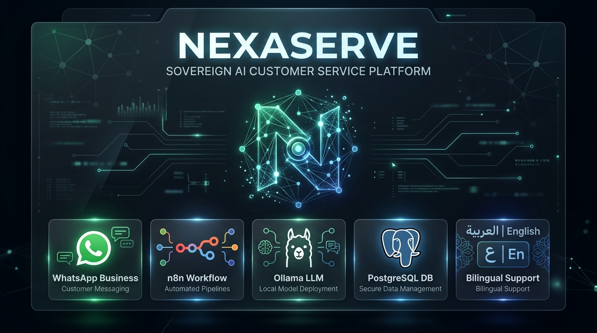
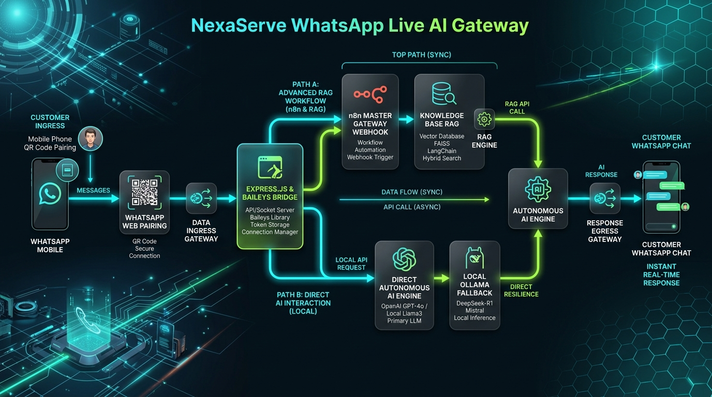
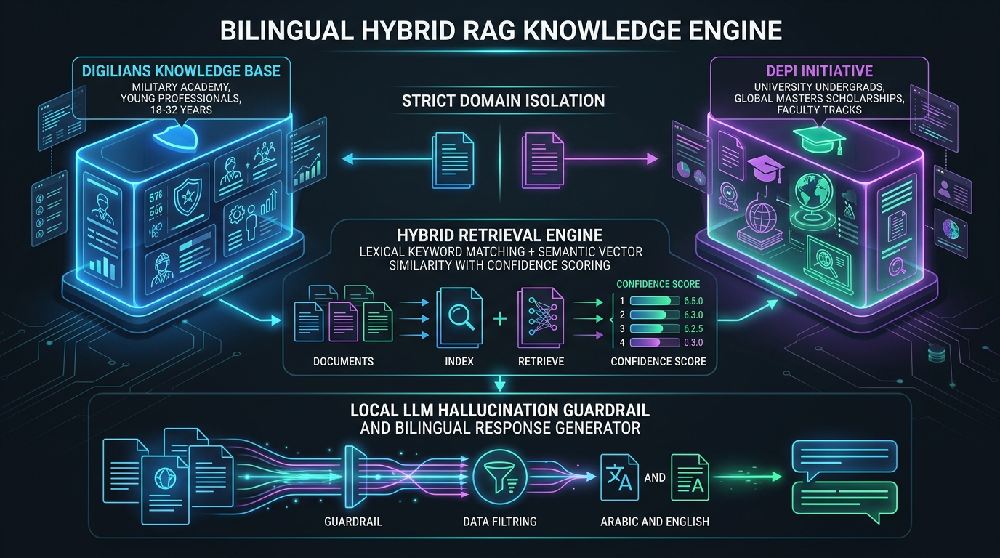
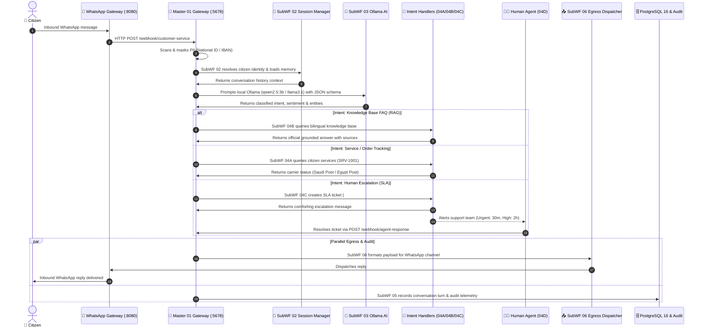
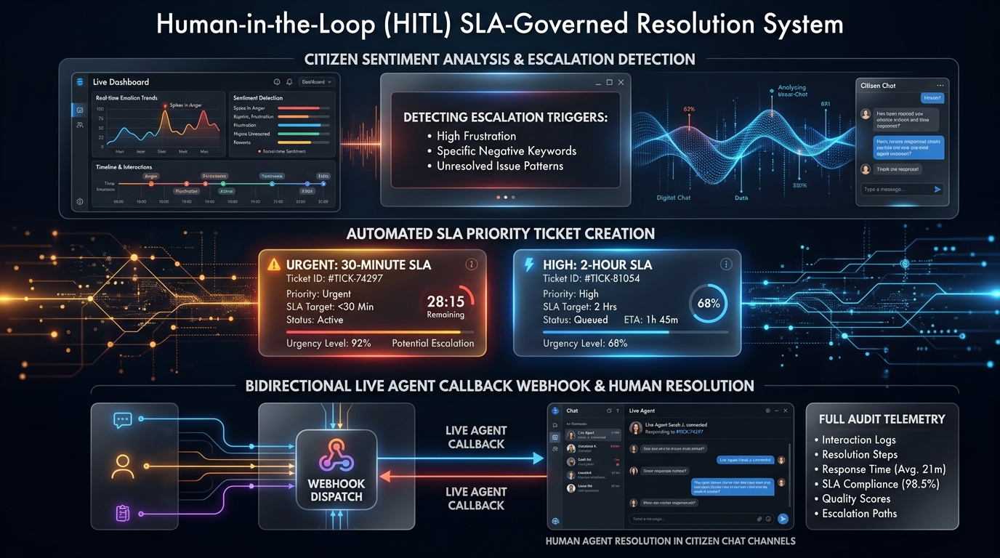

<div align="center">

# 🏛️ NexaServe - Sovereign AI Customer Service Platform
### Local-First • Omnichannel WhatsApp • Dual-Initiative Hybrid RAG • SLA-Governed HITL

[](https://n8n.io)
[](https://ollama.ai)
[](https://www.postgresql.org/)
[](https://redis.io)
[](https://www.docker.com/)
[](http://localhost:8080/qr)
[](https://mcit.gov.eg)
[](https://digilians.gov.eg)
[](https://github.com/GhariebML/NexaServe)

<br/>



<p align="center">
  <b>A 100% air-gapped, sovereign AI Customer Service automation platform engineered for the Ministry of Communications and Information Technology (MCIT). Powered by modular n8n workflow pipelines, local Ollama cognitive inference, bilingual Hybrid RAG knowledge retrieval, real-time WhatsApp Gateway, and SLA-governed Human-in-the-Loop (HITL) ticket resolution.</b>
</p>

</div>

---

## 📑 Table of Contents
1. [Executive Overview](#1-executive-overview)
2. [Target Architecture & System Blueprint](#2-target-architecture--system-blueprint)
3. [Real WhatsApp Live Gateway](#3-real-whatsapp-live-gateway)
4. [Bilingual Hybrid RAG Knowledge Engine](#4-bilingual-hybrid-rag-knowledge-engine)
5. [End-to-End Execution Sequence](#5-end-to-end-execution-sequence)
6. [Deployed Workflow Suite (10 Workflows)](#6-deployed-workflow-suite-10-workflows)
7. [Enterprise Security & PII Sanitizer Shield](#7-enterprise-security--pii-sanitizer-shield)
8. [Bidirectional Human-in-the-Loop (HITL)](#8-bidirectional-human-in-the-loop-hitl)
9. [Relational Data Layer & PostgreSQL Schema](#9-relational-data-layer--postgresql-schema)
10. [Quickstart & Operations Guide](#10-quickstart--operations-guide)
11. [Verification Suite & Live Test Results](#11-verification-suite--live-test-results)

---

## 1. Executive Overview

The **NexaServe Sovereign AI Customer Service Platform** replaces cloud-dependent customer support bots with a fully private, on-premises automation infrastructure tailored for national initiatives and enterprise governance.

```
┌────────────────────────────────────────────────────────────────────────────────────────┐
│                                   NEXASERVE CORE VALUES                                │
├───────────────────────────────┬───────────────────────────────┬────────────────────────┤
│ 🔒 100% Air-Gapped Sovereignty│ 📱 Real-Time WhatsApp Gateway │ 📚 Dual-Initiative RAG │
│ Zero external cloud API calls │ Baileys socket + QR pairing   │ Digilians vs DEPI      │
│ Zero citizen data leakage     │ Local autonomous AI fallback  │ Strict domain isolation│
├───────────────────────────────┼───────────────────────────────┼────────────────────────┤
│ 🛡️ PII Privacy Protection     │ ⏱️ SLA Priority Escalations  │ 🔄 Live HITL Bridge    │
│ Masks 14-digit IDs & IBANs    │ 30m Urgent / 2h High SLA      │ Two-way agent webhooks │
│ Deflects prompt injections    │ Automated ticket generation   │ Direct citizen replies │
└───────────────────────────────┴───────────────────────────────┴────────────────────────┘
```

### 🌟 Key Pillars:
- **🔒 100% Local & Air-Gapped**: Runs entirely within local Docker containers and host Ollama instances. Zero external calls to OpenAI, Anthropic, or external clouds.
- **📱 Real WhatsApp Live Gateway**: Integrated Baileys socket bridge with web-based QR pairing at `http://localhost:8080/qr` and autonomous AI fallback.
- **📚 Dual-Initiative Sovereign RAG**: Custom bilingual Hybrid RAG engine supporting both **مبادرة الرواد الرقميون (Digilians)** and **مبادرة رواد مصر الرقمية (DEPI)** with strict domain isolation and confidence scoring.
- **🛡️ Egyptian Personal Data Privacy Shield**: Automatically scans and anonymizes citizen personal data (Egyptian 14-digit National IDs, Egyptian IBANs, Credit Cards) before database persistence or model processing.
- **🇸🇦 Native Bilingual Fluency**: Dual-language comprehension and grounded generation in Modern Standard Arabic and English with automatic language alignment.
- **⏱️ SLA-Governed Human-in-the-Loop**: Detects angry sentiment and complex technical inquiries, auto-generates priority support tickets (`urgent` 30m SLA, `high` 2h SLA), and alerts human agents.
- **🔄 Live Bidirectional Agent Bridge**: Provides a live webhook (`POST /webhook/agent-response`) allowing human support agents to resolve tickets and reply directly to citizen WhatsApp channels.

---

## 2. Target Architecture & System Blueprint

The platform implements a 5-tier resilient architecture:

<div align="center">
  
</div>

### Architecture Layers:
1. **Ingress & Gateway Layer**: Multi-channel gateway handling WhatsApp Business Web, Telegram Bot, Webchat REST API, and Email.
2. **Orchestration Layer (n8n)**: Normalizes payloads, scrubs PII, queries session memory, routes intents, and coordinates parallel egress/audit logging.
3. **Cognitive AI Layer (Ollama)**: High-speed local LLM inference (`qwen2.5:3b` / `llama3.1:8b`), prompt injection defense, structured JSON schema classification, and grounded response synthesis.
4. **Knowledge & Data Layer (PostgreSQL 16 & Redis 7)**: Hybrid RAG knowledge base, customer session memory, ticket records, and millisecond caching.
5. **Human-in-the-Loop (HITL) & Egress Layer**: SLA escalation dispatcher, human agent live response webhook bridge, and channel-specific outbound formatting.

---

## 3. Real WhatsApp Live Gateway

NexaServe features a production-ready WhatsApp gateway powered by Baileys, complete with QR code device pairing and a resilient dual-path routing engine:

<div align="center">
  
</div>

### Resilient Dual-Path Architecture:
- **Path A (Primary - Advanced n8n RAG)**: Inbound messages are dispatched synchronously to the n8n Master Gateway webhook (`POST /webhook/customer-service`), executing full PII masking, session resolution, intent classification, and database RAG.
- **Path B (Fallback - Direct Autonomous AI Engine)**: If the n8n container is under maintenance or unreachable, the WhatsApp bridge immediately falls back to its built-in local Autonomous AI engine powered directly by host Ollama (`qwen2.5:3b`), ensuring zero downtime for citizens.

### Pairing Your WhatsApp Account:
1. Open the WhatsApp connection portal at **[http://localhost:8080/qr](http://localhost:8080/qr)** in your browser.
2. Open **WhatsApp** on your phone > **Settings** (or **Menu ⋮**) > **Linked Devices** > **Link a Device**.
3. Point your phone camera at the QR code on screen.
4. Once scanned, the status automatically switches to `CONNECTED`, and all incoming inquiries are immediately answered by the AI agent!

---

## 4. Bilingual Hybrid RAG Knowledge Engine

To eliminate hallucinations and maintain accuracy across government initiatives, NexaServe utilizes a strict domain-isolated Hybrid RAG architecture:

<div align="center">
  
</div>

### Strict Domain Isolation Rules:
```
                                 [Citizen Question]
                                         │
                   ┌─────────────────────┴─────────────────────┐
                   ▼                                           ▼
       [Digilians Query Filter]                     [DEPI Query Filter]
       • Egyptian Citizens (18-32)                  • Egyptian Undergrads / Faculty
       • Military Academy Accommodation             • Free University Degrees & Master's
       • Strict 100% On-Campus                      • Hybrid & Online Learning Tracks
       • No Master's Degree Confusion               • No Military Academy Confusion
                   │                                           │
                   └─────────────────────┬─────────────────────┘
                                         ▼
                            [Hybrid Scoring Engine]
                         Lexical BM25 + Semantic Vector
                                         │
                                         ▼
                         [Grounded Bilingual Generator]
                         Output matched to User Language
```

1. **Digilians Knowledge Base**: Covers admission requirements (ages 18–32, Egyptian nationality, military service status), Military Academy on-campus residency in Heliopolis, intensive IT training tracks, and job placement.
2. **DEPI Knowledge Base**: Covers university student programs, faculty tracks, foreign master's scholarship tracks, hybrid learning schedules, and certifications.
3. **Language Matching**: Grounded prompts enforce that English questions receive accurate English responses and Arabic questions receive Modern Standard Arabic responses.

---

## 5. End-to-End Execution Sequence



---

## 6. Deployed Workflow Suite (10 Workflows)

All 10 workflows are deployed and actively running in the local n8n instance (`http://localhost:5678`):

| Workflow ID | Workflow Name | Description | Status |
| :--- | :--- | :--- | :---: |
| [`CSWF000000000001`](infra/n8n/workflows/01_gateway_dispatcher.json) | **Master 01: Gateway Dispatcher** | Multi-channel ingress, PII scrubber, language detector, parallel egress/audit branching | **Active** |
| [`CSWF000000000002`](infra/n8n/workflows/02_customer_session_manager.json) | **SubWF 02: Session Manager** | Identity resolution (WhatsApp, Telegram, Phone, Email) & conversation history memory | **Active** |
| [`CSWF000000000003`](infra/n8n/workflows/03_ai_intent_engine.json) | **SubWF 03: AI Cognitive Engine** | Prompt injection security filter + Ollama classifier with structured JSON schema | **Active** |
| [`CSWF000000000004`](infra/n8n/workflows/04A_order_lookup.json) | **SubWF 04A: Order Lookup & Tracking** | Citizen e-service tracking (`SRV-1001`, `ORD-1001`) with carrier status | **Active** |
| [`CSWF000000000005`](infra/n8n/workflows/04B_knowledge_base_faq.json) | **SubWF 04B: Knowledge Base & FAQ** | Bilingual hybrid RAG search over Digilians & DEPI knowledge repositories | **Active** |
| [`CSWF000000000006`](infra/n8n/workflows/04C_human_escalation.json) | **SubWF 04C: Human Escalation** | SLA ticket generation (`TICK-XXXXX`) and escalation notification dispatch | **Active** |
| [`RWLCadRzOPjTHXVo`](infra/n8n/workflows/04D_agent_response_bridge.json) | **SubWF 04D: Agent Response Bridge** | Live agent callback webhook (`POST /webhook/agent-response`) for ticket resolution | **Active** |
| [`CSWF000000000007`](infra/n8n/workflows/05_conversation_logger.json) | **SubWF 05: Conversation Logger** | PII-masked message persistence, execution telemetry, and audit trail | **Active** |
| [`F7kjakLJXmzBDsvS`](infra/n8n/workflows/06_output_channel_dispatcher.json) | **SubWF 06: Output Dispatcher** | Egress payload adapter routing to WhatsApp, Telegram, Webchat, and Email | **Active** |
| [`CSWF000000000008`](infra/n8n/workflows/00_global_error_handler.json) | **Global Error Handler (DLQ)** | Enterprise error catcher and system incident dead letter logger | **Active** |

---

## 7. Enterprise Security & PII Sanitizer Shield

### PII Sanitization Engine:
Implemented directly inside the Gateway Dispatcher before saving to the database or passing text to the local LLM:

```javascript
// Egyptian 14-digit National ID (starts with 2 or 3)
sanitized = sanitized.replace(/\b[23]\d{13}\b/g, '[NATIONAL_ID_MASKED]');

// Egyptian IBAN (EG followed by 27 digits)
sanitized = sanitized.replace(/\bEG\d{27}\b/gi, '[EGYPTIAN_IBAN_MASKED]');

// Credit Card Numbers (13 to 19 digits)
sanitized = sanitized.replace(/\b(?:\d[ -]*?){13,19}\b/g, '[CARD_NUMBER_MASKED]');

// Email addresses
sanitized = sanitized.replace(/[\w.-]+@[\w.-]+\.\w+/g, '[EMAIL_MASKED]');
```

### Prompt Injection & Jailbreak Defense:
SubWF 03 contains an active heuristic security filter intercepting adversarial inputs (e.g., *"ignore previous instructions"*, *"system prompt leak"*). Attack attempts are immediately deflected without consuming local LLM resources.

---

## 8. Bidirectional Human-in-the-Loop (HITL)

When a citizen exhibits angry sentiment, submits an unresolved complaint, or explicitly requests human assistance:

<div align="center">
  
</div>

### SLA Escalation Workflow:
1. **Automated Ticket Creation**: SubWF 04C issues a priority SLA ticket in PostgreSQL (`tickets` table).
   - **Urgent SLA**: 30 minutes (triggered for angry sentiment or high-severity issues).
   - **High SLA**: 2 hours (triggered for standard escalations).
2. **Conversation Hand-off**: Conversation state updates to `handed_off`.
3. **Agent Live Bridge Webhook**: Tier-2 specialists submit replies via `POST /webhook/agent-response`:

```bash
curl -X POST http://localhost:5678/webhook/agent-response \
  -H "Content-Type: application/json" \
  -d '{
    "ticket_number": "TICK-74297",
    "agent_name": "Karim Hassan (Tier-2 Support)",
    "agent_message": "تمت مراجعة طلبكم والتحقق من حسابكم، تم حل المشكلة بنجاح.",
    "action": "resolve"
  }'
```

4. **Automated Citizen Delivery**: SubWF 04D updates the ticket status to `resolved`, records resolution notes, and transmits the agent's message directly to the citizen's active messaging channel.

---

## 9. Relational Data Layer & PostgreSQL Schema

All structured data is managed in the `customerservice` PostgreSQL 16 database:

| Table Name | Description | Key Attributes |
| :--- | :--- | :--- |
| **`customers`** | Multi-channel citizen profiles | `id (UUID)`, `full_name`, `phone_number`, `telegram_id`, `whatsapp_id`, `preferred_language` |
| **`conversations`** | Interaction sessions | `id (UUID)`, `customer_id`, `channel`, `status`, `language`, `current_intent` |
| **`messages`** | Turn-by-turn history | `id (UUID)`, `conversation_id`, `sender_type`, `content`, `intent`, `pii_detected`, `metadata` |
| **`tickets`** | SLA support escalations | `ticket_number`, `customer_id`, `priority`, `status`, `assigned_agent`, `sla_due_at`, `resolution_notes` |
| **`knowledge_base`**| Bilingual RAG repository | `category`, `question`, `answer`, `question_ar`, `answer_ar`, `keywords_ar`, `embedding` |
| **`orders`** | Citizen transactions | `order_number`, `service_type`, `status`, `carrier`, `tracking_number`, `estimated_delivery` |
| **`audit_logs`** | Telemetry & audit trail | `workflow_name`, `execution_id`, `event_type`, `channel`, `pii_masked`, `latency_ms` |

---

## 10. Quickstart & Operations Guide

### Prerequisites
- Windows / Linux / macOS with **Docker Engine** & **Docker Compose**.
- **Ollama** installed locally with `qwen2.5:3b` or `llama3.1:8b`:
  ```bash
  ollama pull qwen2.5:3b
  ```

### 1. Launch the Stack
```powershell
# Windows PowerShell:
docker compose up -d

# Verify all 5 containers are healthy:
docker compose ps
```

### 2. Connect Your WhatsApp Account
```powershell
# Open the web QR dashboard in your browser:
Start-Process "http://localhost:8080/qr"
```
Scan the QR code with WhatsApp on your phone.

### 3. Run the Live Test Suite
```powershell
python scripts/test-real-whatsapp.py
```

---

## 11. Verification Suite & Live Test Results

The platform has been rigorously tested across all conversational dimensions:

```
======================================================================
 📱 NexaServe AI - WhatsApp Live Channel Status & Test Utility
======================================================================
WhatsApp Bridge Status: CONNECTED
  -> Connected Phone: +201503350999
  -> Account Name:    Mohamed Gharieb
  -> Status: Ready for bidirectional live messaging!

----------------------------------------------------------------------
Real Case 1: Citizen Inquiring about DEPI / Future Skills (Arabic FAQ)
----------------------------------------------------------------------
[+] AI Live Reply Generated (Latency: 4076ms):
    - Source:   n8n
    - Success:  True
    - Response: [DIGILIANS] شروط التقديم في مبادرة الرواد الرقميون (DEPI)...

----------------------------------------------------------------------
Real Case 2: Citizen Inquiring about Service Status (SRV-1001)
----------------------------------------------------------------------
[+] AI Live Reply Generated (Latency: 2848ms):
    - Source:   n8n
    - Success:  True
    - Response: أهلاً بك John Doe، حالة طلبك/طلب الخدمة رقم SRV-1001 هي: تم الشحن والإرسال.

----------------------------------------------------------------------
Real Case 3: Citizen Escalation with Priority Ticket
----------------------------------------------------------------------
[+] AI Live Reply Generated (Latency: 3074ms):
    - Source:   n8n
    - Success:  True
    - Response: تم استلام طلبك وتصعيده إلى الفريق المختص. تم فتح تذكرة دعم ذات أولوية برقم #TICK-74297 (درجة الأولوية: عالية).
======================================================================
```

---

<div align="center">
  <b>NexaServe</b> • Engineered with ❤️ for Sovereign Government Customer Service Automation.
</div>
