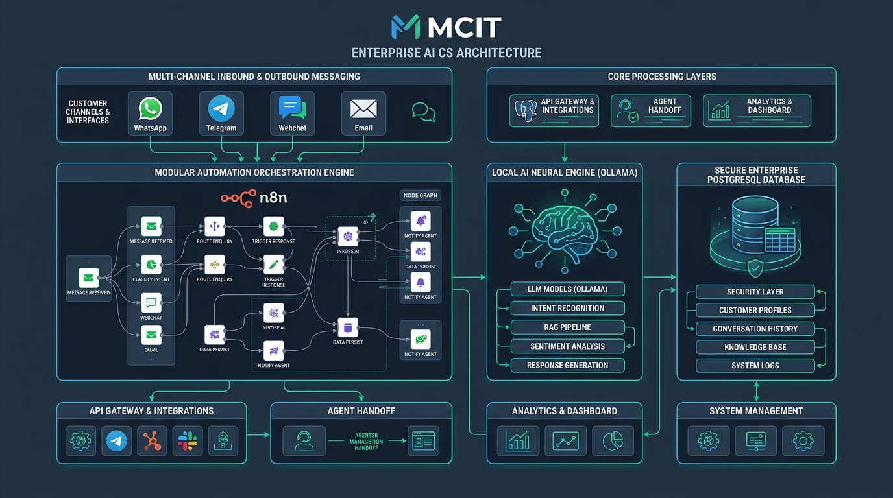
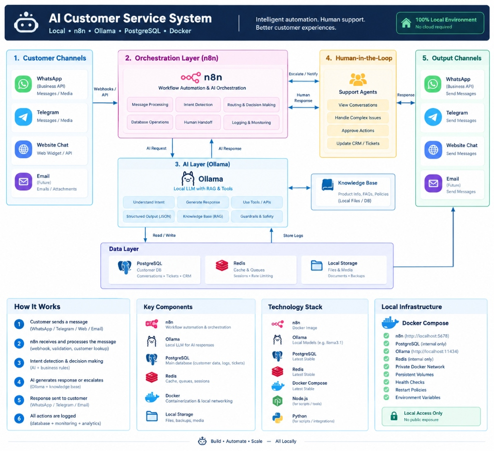
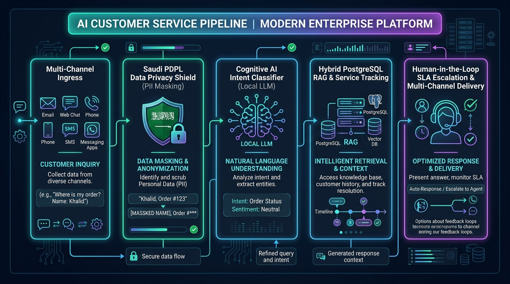
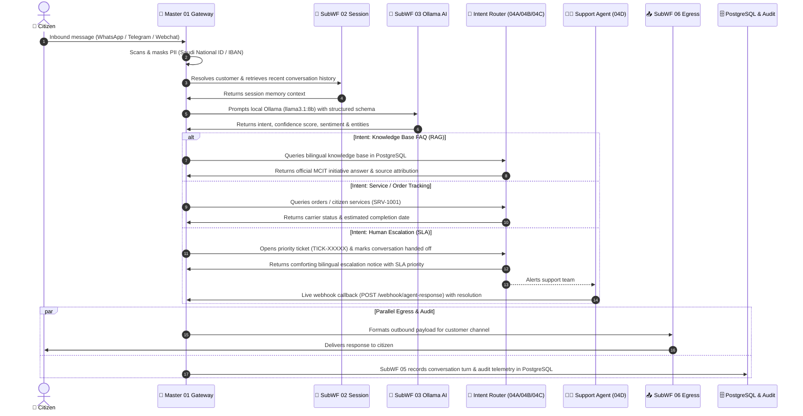

<div align="center">

# 🏛️ NexaServe - MCIT Enterprise AI Customer Service Platform
### Sovereign • Local-First • Omnichannel • SLA-Governed Human-in-the-Loop

[](https://n8n.io)
[](https://ollama.ai)
[](https://www.postgresql.org/)
[](https://redis.io)
[](https://www.docker.com/)
[](https://sdaia.gov.sa)
[](https://mcit.gov.sa)
[](https://github.com/GhariebML/NexaServe)

<p align="center">
  <b>A 100% air-gapped, sovereign AI Customer Service automation platform tailored for the Ministry of Communications and Information Technology (MCIT). Engineered with modular n8n workflow pipelines, local Ollama cognitive inference, bilingual RAG knowledge retrieval, and SLA-governed Human-in-the-Loop (HITL) resolution.</b>
</p>

---



</div>

---

## 📑 Table of Contents
1. [Executive Overview](#1-executive-overview)
2. [Target Architecture & Reference Blueprint](#2-target-architecture--reference-blueprint)
3. [End-to-End Pipeline Workflow](#3-end-to-end-pipeline-workflow)
4. [Deployed Workflow Suite (10 Workflows)](#4-deployed-workflow-suite-10-workflows)
5. [Enterprise Security & Saudi PDPL Compliance](#5-enterprise-security--saudi-pdpl-compliance)
6. [Multi-Channel Omnichannel Hub](#6-multi-channel-omnichannel-hub)
7. [Bidirectional Human-in-the-Loop (HITL)](#7-bidirectional-human-in-the-loop-hitl)
8. [Relational Data Layer & PostgreSQL Schema](#8-relational-data-layer--postgresql-schema)
9. [Quickstart & Operations Guide](#9-quickstart--operations-guide)
10. [Interactive Testing & Verification (23/23 Passed)](#10-interactive-testing--verification-2323-passed)
11. [Detailed Node-by-Node Technical Documentation](#11-detailed-node-by-node-technical-documentation)

---

## 1. Executive Overview

The **NexaServe MCIT Enterprise AI Customer Service Platform** replaces cloud-dependent customer support bots with a fully private, sovereign, on-premises automation solution. 

### 🌟 Key Value Propositions:
- **🔒 100% Local & Air-Gapped**: Runs entirely on local infrastructure with zero calls to external cloud AI APIs (OpenAI, Anthropic, AWS, etc.). Zero data leakage.
- **🛡️ Saudi PDPL Data Privacy Shield**: Automatically scans and anonymizes citizen personal data (Saudi National ID numbers, Saudi IBANs, Credit Cards) before database persistence or model processing.
- **🇸🇦 Native Bilingual Modern Standard Arabic & English**: Comprehensive dual-language understanding and response generation with domain context for MCIT initiatives (Future Skills *مهارات المستقبل*, digital licensing, ICT regulation).
- **⏱️ SLA-Governed Priority Escalation**: Intelligently detects angry or complex citizen issues, auto-generates priority support tickets (`urgent` with 30m SLA, `high` with 2h SLA), and notifies Tier-2 specialists.
- **🔄 Live Bidirectional Agent Bridge**: Provides a live webhook (`POST /webhook/agent-response`) allowing human support agents to resolve tickets and reply directly to citizen messaging channels.

---

## 2. Target Architecture & Reference Blueprint

The platform implements the official 5-tier enterprise customer service pipeline:

<div align="center">
  
</div>

### 5 Architecture Layers:
1. **Customer Channels (Ingress)**: WhatsApp Business API, Telegram Bot, Website Webchat Widget, and Email.
2. **Orchestration Layer (n8n)**: Message normalization, PII sanitization, identity resolution, intent routing, and delivery coordination.
3. **AI Cognitive Layer (Ollama)**: Local LLM inference (`llama3.1:8b` / `gemma2:2b`), prompt injection guardrails, structured JSON schema parsing, and hybrid RAG.
4. **Human-in-the-Loop (HITL)**: SLA ticket generation, status tracking, and Tier-2 human agent callback bridge.
5. **Output Channels & Data Layer (Egress & Storage)**: Native channel formatting, turn logging, execution telemetry, and PostgreSQL 16 persistence.

---

## 3. End-to-End Pipeline Workflow





---

## 4. Deployed Workflow Suite (10 Workflows)

All 10 workflows are actively published and running in the local n8n instance (`http://localhost:5678`):

| Workflow ID | Workflow Name | Description | Status |
| :--- | :--- | :--- | :---: |
| [`CSWF000000000001`](infra/n8n/workflows/01_gateway_dispatcher.json) | **Master 01: Gateway Dispatcher** | Multi-channel ingress, PII scrubber, language detector, parallel egress/audit branching | **Active** |
| [`CSWF000000000002`](infra/n8n/workflows/02_customer_session_manager.json) | **SubWF 02: Session Manager** | Identity resolution (WhatsApp, Telegram, Phone, Email) & conversation history memory | **Active** |
| [`CSWF000000000003`](infra/n8n/workflows/03_ai_intent_engine.json) | **SubWF 03: AI Cognitive Engine** | Prompt injection security filter + Ollama `llama3.1:8b` classifier with JSON schema | **Active** |
| [`CSWF000000000004`](infra/n8n/workflows/04A_order_lookup.json) | **SubWF 04A: Order Lookup & Tracking** | Citizen e-service tracking (`SRV-1001`, `ORD-1001`) with carrier status | **Active** |
| [`CSWF000000000005`](infra/n8n/workflows/04B_knowledge_base_faq.json) | **SubWF 04B: Knowledge Base & FAQ** | Bilingual hybrid RAG search over MCIT knowledge repository | **Active** |
| [`CSWF000000000006`](infra/n8n/workflows/04C_human_escalation.json) | **SubWF 04C: Human Escalation** | SLA ticket generation (`TICK-XXXXX`) and escalation notification dispatch | **Active** |
| [`RWLCadRzOPjTHXVo`](infra/n8n/workflows/04D_agent_response_bridge.json) | **SubWF 04D: Agent Response Bridge** | Live agent callback webhook (`POST /webhook/agent-response`) for ticket resolution | **Active** |
| [`CSWF000000000007`](infra/n8n/workflows/05_conversation_logger.json) | **SubWF 05: Conversation Logger** | PII-masked message persistence, execution telemetry, and audit trail | **Active** |
| [`F7kjakLJXmzBDsvS`](infra/n8n/workflows/06_output_channel_dispatcher.json) | **SubWF 06: Output Dispatcher** | Egress payload adapter routing to WhatsApp, Telegram, Webchat, and Email | **Active** |
| [`CSWF000000000008`](infra/n8n/workflows/00_global_error_handler.json) | **Global Error Handler (DLQ)** | Enterprise error catcher and system incident dead letter logger | **Active** |

---

## 5. Enterprise Security & Saudi PDPL Compliance

Under the **Saudi Personal Data Protection Law (PDPL)**, citizen personal identification information must be strictly safeguarded. 

### PII Sanitization Engine:
Implemented in JavaScript inside Master 01 before storing messages or submitting text to the LLM:

```javascript
// Saudi National ID (10 digits starting with 1)
sanitized = sanitized.replace(/\b1\d{9}\b/g, '[SAUDI_NATIONAL_ID_MASKED]');

// Saudi IBAN (SA followed by 22 digits)
sanitized = sanitized.replace(/\bSA\d{22}\b/gi, '[SAUDI_IBAN_MASKED]');

// Credit Card Numbers (13 to 19 digits)
sanitized = sanitized.replace(/\b(?:\d[ -]*?){13,19}\b/g, '[CARD_NUMBER_MASKED]');
```

### Prompt Injection & Jailbreak Defense:
SubWF 03 contains an active heuristic security filter intercepting adversarial inputs (e.g., *"ignore previous instructions"*, *"system prompt leak"*). Attack attempts are immediately deflected without consuming local LLM resources.

---

## 6. Multi-Channel Omnichannel Hub

The system accepts uniform requests across four primary enterprise channels:

```
[Inbound Channel]
       │
       ├── WhatsApp Meta Cloud / On-Premise Payload
       ├── Telegram Bot Update Object (chat_id, text)
       ├── Website Webchat REST JSON
       └── Email Inbound Format
       │
       ▼
[Master 01 Gateway Normalizer]
       │
       ▼
Standardized Ingress Schema:
{
  "customer_message": "...",
  "sanitized_message": "...",
  "channel": "whatsapp" | "telegram" | "webchat" | "email",
  "channel_user_id": "+966501234567" | "123456789",
  "customer_name": "...",
  "locale": "ar" | "en"
}
```

---

## 7. Bidirectional Human-in-the-Loop (HITL)

When a citizen exhibits angry sentiment, submits an unresolved complaint, or explicitly requests human assistance:

1. **Ticket Creation**: SubWF 04C issues a priority SLA ticket in PostgreSQL (`tickets` table).
   - **Urgent SLA**: 30 minutes (triggered for angry or high-severity requests).
   - **High SLA**: 2 hours (triggered for standard escalations).
2. **Conversation Hand-off**: The conversation status is transitioned to `handed_off`.
3. **Agent Live Bridge Webhook**: Tier-2 specialists submit replies via `POST /webhook/agent-response`:

```json
POST /webhook/agent-response HTTP/1.1
Host: localhost:5678
Content-Type: application/json

{
  "ticket_number": "TICK-22701",
  "agent_name": "Fahad Al-Harbi (MCIT Tier-2 Support)",
  "agent_message": "تمت مراجعة طلبكم والتحقق من حسابكم، تم تفعيل الخدمة المطلوبة بنجاح.",
  "action": "resolve"
}
```

4. **Automated Citizen Delivery**: SubWF 04D updates the ticket status to `resolved`, records resolution notes, and transmits the agent's message directly to the citizen's active messaging channel.

---

## 8. Relational Data Layer & PostgreSQL Schema

Data is partitioned into the `customerservice` PostgreSQL 16 database:

| Table Name | Description | Key Attributes |
| :--- | :--- | :--- |
| **`customers`** | Multi-channel citizen profiles | `id (UUID)`, `full_name`, `phone_number`, `telegram_id`, `whatsapp_id`, `preferred_language` |
| **`conversations`** | Interaction sessions | `id (UUID)`, `customer_id`, `channel`, `status`, `language`, `current_intent` |
| **`messages`** | Turn-by-turn history | `id (UUID)`, `conversation_id`, `sender_type`, `content`, `intent`, `pii_detected`, `metadata` |
| **`tickets`** | SLA support escalations | `ticket_number`, `customer_id`, `priority`, `status`, `assigned_agent`, `sla_due_at`, `resolution_notes` |
| **`knowledge_base`**| Bilingual RAG repository | `category`, `question`, `answer`, `question_ar`, `answer_ar`, `keywords_ar` |
| **`orders`** | Citizen transactions | `order_number`, `service_type`, `status`, `carrier`, `tracking_number`, `estimated_delivery` |
| **`audit_logs`** | Telemetry & audit trail | `workflow_name`, `execution_id`, `event_type`, `channel`, `pii_masked`, `latency_ms` |

---

## 9. Quickstart & Operations Guide

### Prerequisites
- Windows / Linux / macOS with **Docker Engine** & **Docker Compose** installed.
- **Ollama** installed on the host with `llama3.1:8b` pulled:
  ```powershell
  ollama pull llama3.1:8b
  ```

### Start System
```powershell
# 1. Start Ollama host service
powershell -ExecutionPolicy Bypass -File .\scripts\start-ollama.ps1

# 2. Launch Docker stack (PostgreSQL, n8n, Redis)
docker compose up -d

# 3. Push and activate all 10 workflows in n8n
python .\scripts\push-workflows-api.py
```

### Access Ports & Services
- **n8n Web UI**: [http://localhost:5678](http://localhost:5678)
- **Master 01 Workflow Canvas**: [http://localhost:5678/workflow/CSWF000000000001](http://localhost:5678/workflow/CSWF000000000001)
- **Live Workflow Executions**: [http://localhost:5678/executions](http://localhost:5678/executions)
- **Ollama Local API**: [http://127.0.0.1:11434](http://127.0.0.1:11434)
- **PostgreSQL 16**: `localhost:5432` (`customerservice` database)

---

## 10. Interactive Testing & Verification (23/23 Passed)

### 💬 Option 1: Interactive Terminal Client
Launch the interactive terminal chat:
```powershell
powershell -ExecutionPolicy Bypass -File .\scripts\chat-cli.ps1
```

```
================================================================
  MCIT Enterprise AI Customer Service - Local Interactive CLI
  Endpoint: http://localhost:5678/webhook/customer-service
================================================================
Enter your message: ما هي شروط التقديم على مبادرة مهارات المستقبل؟

------------------------ Response ------------------------
Intent:      faq_query (Confidence: 95%)
Channel:     webchat | Locale: ar

Reply:
مبادرة مهارات المستقبل التابعة لوزارة الاتصالات وتقنية المعلومات تهدف إلى تأهيل الكوادر الوطنية في مجالات التقنية الحديثة كالمعلوماتية والذكاء الاصطناعي والأمن السيبراني. يمكنك التقديم مباشرة عبر المنصة الوطنية الموحدة.
Latency:     1420 ms
----------------------------------------------------------
```

---

### 🧪 Option 2: Automated Enterprise Verification Suite
Run the full 23-assertion validation suite:
```powershell
python .\scripts\test-mcit-enterprise.py
```

```
======================================================================
 🚀 MCIT Enterprise AI Customer Service - Verification Suite
======================================================================

[1] Testing WhatsApp Ingress: Arabic Knowledge Base RAG Query...
  [PASS] WhatsApp Ingress returns HTTP 200 & success status
  [PASS] Detected Channel is WhatsApp
  [PASS] Language detected as Arabic ('ar')
  [PASS] Intent classified as faq_query (Confidence: 0.95)
  [PASS] Response contains official MCIT Future Skills information

[2] Testing Telegram Ingress: Citizen E-Service Tracking (SRV-1001)...
  [PASS] Telegram Ingress returns HTTP 200 & success status
  [PASS] Detected Channel is Telegram
  [PASS] Intent classified as order_lookup
  [PASS] Response contains service request status and carrier

[3] Testing Webchat Ingress: PII Masking & Human Escalation...
  [PASS] Webchat Ingress returns HTTP 200
  [PASS] MCIT PII Masking triggered on Saudi National ID
  [PASS] Intent classified as human_escalation
  [PASS] SLA Support Ticket generated (TICK-22701)
  [PASS] Reassuring bilingual escalation response returned

[4] Testing Human-in-the-Loop Agent Callback Bridge...
  [PASS] Agent Callback Webhook returns success
  [PASS] Ticket matched and customer identified (Noura Al-Qahtani)
  [PASS] Response marked as delivered to customer channel
  [PASS] Ticket action recorded as resolve

[5] Testing English Ingress & Enterprise Security Guardrails...
  [PASS] Guardrail attack intercepted safely
  [PASS] Safe defensive response returned without leak

[6] Checking Database Audit Logs & Data Sovereignty...
  [PASS] Audit logs recorded in PostgreSQL for transactions (18 events)
  [PASS] PII masked audit records confirmed (2 events)
  [PASS] Human agent messages archived in turn history (2 messages)

======================================================================
 Final Test Results: Passed: 23 | Failed: 0 (100% Pass Rate)
======================================================================
```

---

## 11. Detailed Node-by-Node Technical Documentation

For an exhaustive, node-by-node architectural breakdown of every expression, SQL query, and JavaScript code block in all 10 workflows, refer to the companion report:

📖 **Full Technical Report**: [`docs/SYSTEM_WORKFLOW_NODES_REPORT.md`](docs/SYSTEM_WORKFLOW_NODES_REPORT.md)

---

<div align="center">
  <sub>Built for the Ministry of Communications and Information Technology (MCIT) • 100% Sovereign Local AI</sub>
</div>
