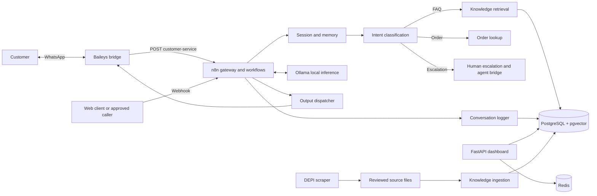

# NexaServe

**Local-first customer service automation with WhatsApp, n8n workflows, retrieval-augmented answers, and human escalation.**

NexaServe is a self-hostable customer support system for teams operating the DEPI and Digilians initiatives. It accepts customer messages through a Baileys-based WhatsApp bridge and an n8n webhook, routes requests through session and intent workflows, retrieves knowledge from PostgreSQL with pgvector, and calls a locally hosted Ollama model. It also includes workflow paths for order lookup, human escalation, agent responses, output dispatch, and conversation logging, plus a FastAPI operations dashboard.

The repository includes a Ministry-oriented Ubuntu deployment bundle. The bundle is a **deployment candidate**, not a production-readiness certification. Target GPU/model behavior, source provenance, full workflow activation, and real WhatsApp delivery require environment-specific validation before public use.


> [!IMPORTANT]
> Do not use the presence of healthy containers or an HTTP 200 as evidence that customer answers are correct. See [deployment/BUILD_REPORT.md](deployment/BUILD_REPORT.md) and [deployment/DEPLOYMENT.md](deployment/DEPLOYMENT.md) for verified checks, known issues, and the acceptance procedure.

## Contents

- [Overview](#overview)
- [Project status](#project-status)
- [Key capabilities](#key-capabilities)
- [Architecture](#architecture)
- [System components](#system-components)
- [Requirements](#requirements)
- [Quick start](#quick-start)
- [Ministry server deployment](#ministry-server-deployment)
- [GPU and local models](#gpu-and-local-models)
- [Configuration](#configuration)
- [Database and knowledge retrieval](#database-and-knowledge-retrieval)
- [n8n workflows](#n8n-workflows)
- [WhatsApp bridge](#whatsapp-bridge)
- [Dashboard](#dashboard)
- [Security and operations](#security-and-operations)
- [Health checks and testing](#health-checks-and-testing)
- [Backup, upgrade, and rollback](#backup-upgrade-and-rollback)
- [Offline deployment](#offline-deployment)
- [Troubleshooting](#troubleshooting)
- [Repository layout](#repository-layout)
- [Documentation](#documentation)
- [Contributing](#contributing)
- [License](#license)

## Overview

NexaServe coordinates a customer-service conversation across a WhatsApp bridge, workflow automation, local language-model inference, PostgreSQL-backed application and knowledge data, and human support workflows. Its current deployment package targets Ubuntu Server 24.04 on x86_64 and uses Docker Compose.

The deployment bundle packages the existing WhatsApp bridge, FastAPI dashboard, scraper and ingestion code, database schema and additive migrations, and ten canonical n8n workflow exports. It does not contain a live customer database, runtime credentials, a linked WhatsApp session, or n8n credential records.

## Project status

| State | Evidence |
|---|---|
| **Verified locally** | Deployment Compose variants parse; static bundle, checksum, secret-pattern, permissions, and workflow JSON checks pass. These checks do not start the deployment or prove answer quality. |
| **In development / deployment candidate** | Ubuntu deployment scripts, optional proxy, dashboard packaging, and online/offline deployment paths are included. |
| **Requires environment validation** | Ministry target installation, GPU inference, model quality and concurrency, database migration on target, workflow credentials and activation, official-source traceability, WhatsApp outbound delivery, backup restore, and final operational sign-off. |

The current readiness finding is **NOT READY for production use**. Previous runtime observations include Ollama generation failures under resource pressure, overload responses, incomplete Digilians source lineage, and no verified real WhatsApp outbound end-to-end test. The bundle does not claim to have fixed these runtime findings. See [the build report](deployment/BUILD_REPORT.md).

## Key capabilities

| Capability | What is present in the repository |
|---|---|
| Message intake | Baileys WhatsApp bridge and n8n customer-service webhook. |
| Workflow routing | Gateway, customer session, AI intent, order lookup, knowledge/FAQ, human escalation, agent response, output, logger, and global error workflow exports. |
| RAG and knowledge | PostgreSQL knowledge schema with `vector(768)`, packaged ingestion code, FAQ/PDF/XLSX materials, and DEPI scraper output. |
| Local inference | Ollama deployment configured for `qwen2.5:3b` and `nomic-embed-text`; actual model performance depends on target resources. |
| Human support | Escalation and agent response workflow paths are included; operational notification and end-to-end behavior must be tested in the target environment. |
| Operations dashboard | Existing FastAPI/static dashboard packaged as a Compose service, with additive admin schema migration. |
| Service state | PostgreSQL 16 with pgvector and Redis 7. |
| Deployment operations | Ubuntu runbook, Compose overlays, health and smoke scripts, backup/restore scripts, integrity checks, and an offline packaging path. |

## Architecture


```mermaid
flowchart LR
    Citizen[Customer] <-->|WhatsApp| WA[Baileys bridge]
    WA -->|POST customer-service| N8N[n8n gateway and workflows]
    Client[Web client or approved caller] -->|Webhook| N8N
    N8N --> Session[Session and memory]
    Session --> Intent[Intent classification]
    Intent -->|FAQ| RAG[Knowledge retrieval]
    Intent -->|Order| Order[Order lookup]
    Intent -->|Escalation| HITL[Human escalation and agent bridge]
    RAG --> PG[(PostgreSQL + pgvector)]
    N8N <--> Ollama[Ollama local inference]
    N8N --> Output[Output dispatcher]
    Output --> WA
    N8N --> Logger[Conversation logger]
    Logger --> PG
    Dashboard[FastAPI dashboard] --> PG
    Dashboard --> Redis[(Redis)]
    Scraper[DEPI scraper] --> Source[Reviewed source files]
    Source --> Ingest[Knowledge ingestion]
    Ingest --> PG
```

### Network exposure in the deployment bundle

PostgreSQL, Redis, and Ollama are internal to the Compose network and have no host-published ports. n8n, WhatsApp, and the dashboard bind to localhost by default: `5678`, `8080`, and `8090`. The optional Nginx `proxy` profile publishes `80` and `443`; it requires operator-provided TLS files and perimeter controls. The `/qr` route can link a WhatsApp account and must be restricted to an authorized administration network.

## System components

| Component | Deployment role | Default image / port |
|---|---|---|
| `postgres` | Application databases and pgvector knowledge storage | `pgvector/pgvector:pg16`, internal `5432` |
| `redis` | Cache/status support | `redis:7-bookworm`, internal `6379` |
| `ollama` | Local chat and embedding inference | `ollama/ollama`, internal `11434` |
| `n8n` | Workflow orchestration and webhooks | `n8nio/n8n:2.38.1`, localhost `5678` |
| `whatsapp` | Baileys bridge and pairing portal | Built from `deployment/application/whatsapp`, localhost `8080` |
| `dashboard` | FastAPI/static operations UI | Built from `deployment/application/dashboard`, localhost `8090` |
| `proxy` | Optional Nginx TLS ingress | `nginx:stable-alpine`, profile `proxy`, host `80`/`443` |
| `scraper`, `kb-ingest` | Optional source refresh and knowledge ingestion | Built from included source, profile `tools` |

Compose image references in the deployment bundle are pinned by digest where applicable. The dashboard, WhatsApp bridge, scraper, and ingestion images are built from included sources.

## Requirements

For the documented deployment target, use Ubuntu Server 24.04 LTS, x86_64, Docker Engine with Compose v2, and an NVIDIA GPU/runtime approved for the selected driver and model workload. The runbook gives planning guidance of at least 8 CPU cores, 32 GiB RAM, 100 GiB free disk, and approximately 12 GiB GPU VRAM; these are not guarantees of throughput or answer quality. Measure on the actual target.

You will also need Ministry-approved DNS and time synchronization, package/image/model sources (or an offline bundle), firewall policy, TLS material for public ingress, an administration account, secret storage, backup destination, and a WhatsApp test account if that channel is being accepted.

See [deployment/docs/prerequisites.md](deployment/docs/prerequisites.md) and [deployment/docs/ubuntu_24_04.md](deployment/docs/ubuntu_24_04.md).

## Quick start

For a connected Ubuntu target with Docker and an available NVIDIA Container Toolkit:

```bash
cd deployment
bash scripts/00_preflight.sh
bash scripts/prepare_environment.sh
bash scripts/deploy.sh gpu
bash scripts/healthcheck.sh
bash scripts/smoke.sh
```

This brings up services and runs infrastructure checks. It does **not** import and activate workflows, establish n8n credentials, prove model generation quality, pair WhatsApp, or certify the system. Follow the full [deployment runbook](deployment/DEPLOYMENT.md) before using customer traffic.

## Ministry server deployment

The package-specific guide is [`deployment/DEPLOYMENT.md`](deployment/DEPLOYMENT.md). Its high-level sequence is:

1. Transfer the bundle and verify `sha256sum -c MANIFEST.sha256`.
2. Validate Ubuntu, storage, network policy, Docker, and GPU passthrough.
3. Generate a new target `.env` with `bash scripts/prepare_environment.sh`; store secrets using Ministry policy.
4. Review Compose configuration and deploy using the documented online or offline path.
5. Check container health, PostgreSQL extensions, Ollama model generation, and dashboard access.
6. Create n8n credentials, import and review workflow exports, and activate only after their credentials, subworkflow references, and webhook paths are verified.
7. Review official knowledge sources and provenance, ingest approved materials, and replay grounded-answer test cases.
8. Configure restricted ingress and TLS, test WhatsApp using an approved account, correlate the delivered answer to the execution and logs, and perform a restore drill.
9. Complete the operational acceptance gate before opening public access.

Do not reset a populated database or delete Docker volumes as part of deployment or troubleshooting. Fresh initialization SQL is for a new empty database volume; existing installations require a verified backup and reviewed additive migrations.

## GPU and local models

The optional GPU overlay is [`deployment/compose/docker-compose.gpu.yml`](deployment/compose/docker-compose.gpu.yml). Validate host drivers and container passthrough with:

```bash
bash scripts/03_install_nvidia_toolkit.sh
bash scripts/verify_gpu.sh
```

The packaged defaults are `qwen2.5:3b` for chat and `nomic-embed-text` for embeddings, with embedding dimension `768`. Initialize models using:

```bash
bash scripts/13_initialize_models.sh
```

An `ollama list` result only proves model files are present. The deployment acceptance procedure requires a real generation request, measured resource use, and response-quality validation. Prior runtime evidence includes OOM/overload behavior, so target load testing is a release gate. See [model operations](deployment/docs/models.md), [Ollama](deployment/docs/ollama.md), and [GPU setup](deployment/docs/nvidia_gpu.md).

## Configuration

Start with [`deployment/.env.example`](deployment/.env.example). Generate a target-specific `.env` rather than copying workstation secrets. Important settings include database credentials, n8n encryption and JWT secrets, dashboard JWT secret, Redis password, model names/dimension, local service ports, timezone, webhook URL, and optional TLS directory.

Do not commit `.env`, n8n credentials, WhatsApp session data, TLS private keys, database exports, or model archives containing restricted material. See [environment configuration](deployment/docs/environment.md) and [security operations](deployment/docs/security.md).

## Database and knowledge retrieval

The bundle provisions PostgreSQL 16 with pgvector and schema/migrations for the application, workflow database, knowledge base, and dashboard administration. The knowledge embedding column is `vector(768)`. Redis is configured as a private authenticated service. The ingestion tooling uses Ollama embeddings and the deployment runbook describes source review and migration handling.

The deployment package includes DEPI scraper output and FAQ/PDF/XLSX materials. It does not include a dump of the live knowledge database. The available evidence does not establish complete official Digilians source lineage; validate source ownership and accuracy before ingesting or relying on those materials. Never infer freshness from the existence of scraper files—check source URL, crawl time, content hash, database row, active state, and embedding.

See [database](deployment/docs/database.md), [pgvector](deployment/docs/pgvector.md), and [knowledge refresh](deployment/scripts/refresh_sources.sh).

## n8n workflows

Ten canonical workflow JSON exports are packaged under [`deployment/assets/n8n/workflows`](deployment/assets/n8n/workflows):

1. Global Error Handler & Dead Letter Queue
2. Customer Service Gateway & Dispatcher
3. Customer Profile & Session Manager
4. AI Cognitive & Intent Engine
5. Order Lookup & Tracking
6. Knowledge Base & FAQ
7. Human in the Loop Escalation
8. Human in the Loop Agent Bridge
9. Conversation & Audit Logger
10. Output Channel Dispatcher

All ten exports are **inactive** and n8n credential records are omitted. Importing JSON is not deployment completion. Create and assign target credentials, inspect workflow/subworkflow IDs and URLs, run test executions, and only then activate reviewed workflows. See [n8n setup](deployment/docs/n8n.md) and [`deployment/scripts/deploy_workflows.sh`](deployment/scripts/deploy_workflows.sh).

## WhatsApp bridge

The included Node.js bridge uses Baileys and persists pairing state in the `whatsapp-auth` named volume. The deployment publishes its portal at `http://127.0.0.1:8080/qr` by default; access it through a protected local tunnel or approved private network. Do not expose the QR route publicly. A healthy bridge does not prove messages are being processed or that the generated response reaches the handset. Verify the full inbound-to-outbound path with an approved test account. See [WhatsApp operations](deployment/docs/whatsapp.md).

## Dashboard

The deployment builds the included FastAPI/static dashboard and publishes it at `http://127.0.0.1:8090` by default. Create the first operator account with `bash scripts/create_dashboard_admin.sh`; there is no packaged default password. The dashboard uses PostgreSQL and Redis configuration from the target environment. See [dashboard operations](deployment/docs/dashboard.md).

## Security and operations

- Keep PostgreSQL, Redis, Ollama, n8n administration, and WhatsApp pairing off public interfaces.
- Restrict proxy ingress to Ministry-approved routes and networks; supply TLS keys through protected host paths.
- Store `.env`, database backups, WhatsApp auth data, and n8n data as sensitive operational material.
- Review workflow SQL, permissions, logging/retention, authentication, dependency and image provenance, and source-data licensing before production.
- Docker health checks and static scans are useful diagnostics, not a penetration test or a privacy/compliance certification.

Operational checklists are in [the runbook](deployment/docs/operations_runbook.md), [firewall guidance](deployment/docs/firewall.md), [networking](deployment/docs/networking.md), and [reverse proxy guidance](deployment/docs/reverse_proxy.md).

## Health checks and testing

From the deployment directory:

```bash
bash scripts/healthcheck.sh
bash scripts/smoke.sh
bash tests/smoke/compose_config.sh
bash tests/deployment/check_bundle.sh
```

The first scripts inspect container/extension/model presence; the latter checks Compose parsing and bundle integrity. None alone proves RAG relevance, grounded answers, workflow node execution, program isolation, WhatsApp delivery, or recovery. Run the target acceptance cases in the Ministry runbook and preserve redacted evidence. The verified local checks and checks not run are listed in [BUILD_REPORT.md](deployment/BUILD_REPORT.md).

## Backup, upgrade, and rollback

Use `bash scripts/backup.sh` and store backups in approved encrypted off-host storage. A backup is not verified until restored in an isolated recovery environment. Do not copy a live PostgreSQL data directory as a backup.

For upgrades, take and verify a backup, preserve the previous bundle and image references, apply reviewed additive migrations, deploy, and repeat acceptance tests before reopening ingress. `scripts/rollback.sh` requires explicit operator confirmation, redeploys a previous bundle while preserving named volumes, and does not reverse SQL changes. See [backup and restore](deployment/docs/backup_restore.md), [upgrade](deployment/docs/upgrade.md), and [rollback](deployment/docs/rollback.md).

## Offline deployment

An offline staging workflow is provided in [`deployment/scripts/prepare_offline_bundle.sh`](deployment/scripts/prepare_offline_bundle.sh). It is intended to run on an approved connected Linux builder and packages container images and the local Ollama model store. The target uses [`deployment/scripts/install_offline.sh`](deployment/scripts/install_offline.sh) with `deployment/compose/docker-compose.offline.yml`.

Host Ubuntu/NVIDIA packages are not vendored. The image/model transfer path has not been validated on the Ministry target; confirm compatible Ollama versions and run generation and recovery checks after import. See [offline installation](deployment/docs/offline_install.md).

## Troubleshooting

| Symptom | First checks |
|---|---|
| Service is unhealthy | `docker compose ps` and `docker compose logs <service>`; then follow the component runbook. |
| Model is listed but answers fail | Run a real generation test; inspect RAM/VRAM, model logs, concurrency, and prompt/context size. Do not accept `ollama list` alone. |
| n8n webhook does not route | Check workflow activation, credentials, webhook URL, imported subworkflow references, and execution details. |
| Knowledge answer is irrelevant | Trace selected program, active KB rows, source metadata, embedding, retrieval result, context, and final output. |
| WhatsApp pairing or delivery fails | Check bridge health and persistent auth volume; restrict `/qr`; correlate bridge and n8n execution with the test handset. |
| Disk or database issue | Check approved storage and backups. Do not run volume-pruning commands or delete database directories. |

See [the detailed troubleshooting guide](deployment/docs/troubleshooting.md). Stop release acceptance for OOM, unsupported responses, cross-program leakage, untraceable sources, or failed message delivery.

## Repository layout

```text
.
├── dashboard/                 # Existing FastAPI/static dashboard source
├── DEPI_Web_Scraper/          # Existing scraper project
├── FAQs/                      # FAQ source materials
├── infra/                     # Existing local Compose services and config
├── scripts/                   # Repository operational utilities
├── tests/                     # Existing repository tests
├── docs/                       # Runtime audit and project documentation
└── deployment/                # Ubuntu deployment candidate
    ├── application/           # Packaged dashboard, WhatsApp, scraper, ingestion
    ├── assets/                # Schema, Redis config, inactive n8n exports
    ├── checks/                # Integrity, permissions, ports, storage, GPU checks
    ├── compose/               # Base, GPU, and offline Compose files
    ├── config/                # Optional Nginx and systemd examples
    ├── docs/                  # Deployment and operations guides
    ├── migrations/            # Additive SQL migrations
    ├── scripts/               # Provisioning, deployment, backup, and recovery
    └── tests/                 # Static bundle and health/smoke helpers
```

## Documentation

| Topic | Guide |
|---|---|
| Full deployment sequence | [deployment/DEPLOYMENT.md](deployment/DEPLOYMENT.md) |
| Package overview | [deployment/README.md](deployment/README.md) |
| Quickstart | [deployment/QUICKSTART.md](deployment/QUICKSTART.md) |
| Architecture | [deployment/docs/architecture.md](deployment/docs/architecture.md) |
| Environment | [deployment/docs/environment.md](deployment/docs/environment.md) |
| Database and pgvector | [database](deployment/docs/database.md) · [pgvector](deployment/docs/pgvector.md) |
| Models and GPU | [models](deployment/docs/models.md) · [Ollama](deployment/docs/ollama.md) · [NVIDIA GPU](deployment/docs/nvidia_gpu.md) |
| n8n and WhatsApp | [n8n](deployment/docs/n8n.md) · [WhatsApp](deployment/docs/whatsapp.md) |
| Backup, restore, upgrade | [backup/restore](deployment/docs/backup_restore.md) · [upgrade](deployment/docs/upgrade.md) · [rollback](deployment/docs/rollback.md) |
| Forensic build evidence | [deployment/BUILD_REPORT.md](deployment/BUILD_REPORT.md) |

## Contributing

Contributions should preserve existing customer data and distinguish static configuration checks from runtime behavior. For workflow, retrieval, model, or routing changes, include reproducible test cases and evidence for program selection, retrieved source, context sent to the model, final response, and delivery path. Do not include credentials, customer PII, WhatsApp session data, or production exports in pull requests.

## License

No repository license file was found during preparation of this README. Until a license is added, do not assume that the source is available for unrestricted reuse; consult the project owner.
