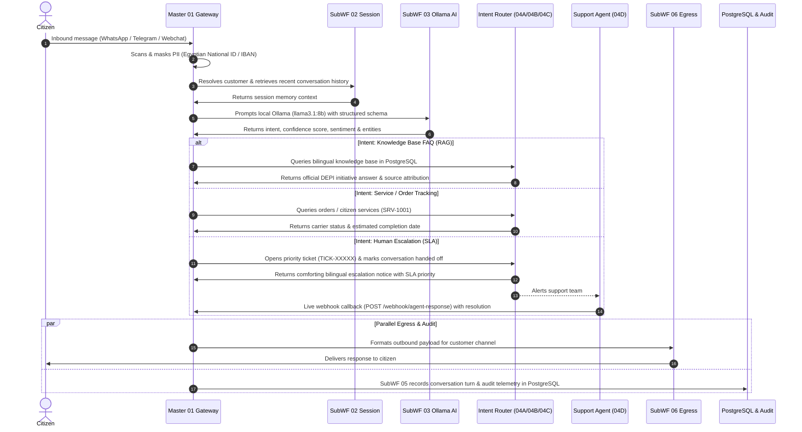
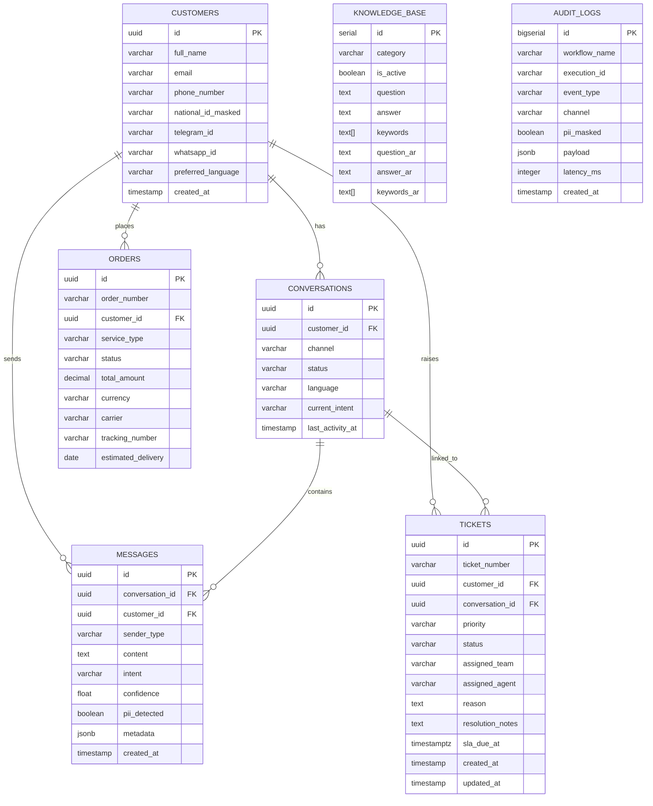
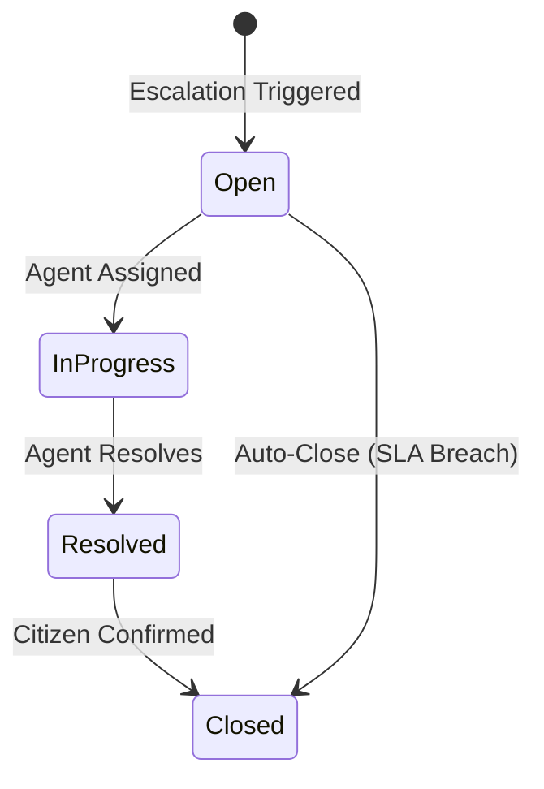

<div align="center">

# NexaServe DEPI AI Customer Service Platform

### Complete System Documentation & Technical Specification Report

---

[](https://n8n.io)
[](https://ollama.ai)
[](https://www.postgresql.org/)
[](https://redis.io)
[](https://www.docker.com/)
[](https://depi.gov.eg)
[](https://digilians.gov.eg)
[](https://github.com/GhariebML/NexaServe)

---

**Sovereign -- Local-First -- Omnichannel -- SLA-Governed Human-in-the-Loop**

---

| Document Property | Value |
| :--- | :--- |
| **Document Title** | NexaServe DEPI AI Customer Service Platform -- System Specification Report |
| **Version** | 1.0.0 |
| **Date** | September 14, 2026 |
| **Classification** | Internal -- DEPI Confidential |
| **Prepared For** | Ministry of Communications and Information Technology, Egypt |
| **Platform Status** | 23/23 Verification Tests Passed |

---

</div>

---

## Table of Contents

| Section | Title | Page |
| :---: | :--- | :---: |
| 1 | [Document Control](#1-document-control) | 3 |
| 2 | [Executive Summary](#2-executive-summary) | 4 |
| 3 | [System Architecture](#3-system-architecture) | 6 |
| 4 | [Technology Stack & Infrastructure](#4-technology-stack--infrastructure) | 9 |
| 5 | [Workflow Suite -- Complete Node-by-Node Specification](#5-workflow-suite----complete-node-by-node-specification) | 12 |
| 5.1 | [Master 01: Gateway Dispatcher](#51-master-01-customer-service-gateway--dispatcher) | 12 |
| 5.2 | [SubWF 02: Session Manager](#52-subwf-02-customer-profile--session-manager) | 15 |
| 5.3 | [SubWF 03: AI Cognitive Engine](#53-subwf-03-ai-cognitive--intent-engine) | 16 |
| 5.4 | [SubWF 04A: Order Lookup & Tracking](#54-subwf-04a-order-lookup--tracking) | 18 |
| 5.5 | [SubWF 04B: Knowledge Base & FAQ (Bilingual RAG)](#55-subwf-04b-knowledge-base--faq-bilingual-rag) | 19 |
| 5.6 | [SubWF 04C: Human-in-the-Loop Escalation](#56-subwf-04c-human-in-the-loop-escalation) | 20 |
| 5.7 | [SubWF 04D: Human-in-the-Loop Agent Bridge](#57-subwf-04d-human-in-the-loop-agent-bridge) | 21 |
| 5.8 | [SubWF 05: Conversation & Audit Logger](#58-subwf-05-conversation--audit-logger) | 22 |
| 5.9 | [SubWF 06: Output Channel Dispatcher](#59-subwf-06-output-channel-dispatcher) | 23 |
| 5.10 | [SubWF 00: Global Error Handler & Dead Letter Queue](#510-subwf-00-global-error-handler--dead-letter-queue) | 24 |
| 6 | [Database Schema & Data Sovereignty Layer](#6-database-schema--data-sovereignty-layer) | 25 |
| 7 | [Security & DEPI Data Protection Compliance](#7-security--saudi-pdpl-compliance) | 29 |
| 8 | [Omnichannel Integration](#8-omnichannel-integration) | 31 |
| 9 | [Human-in-the-Loop (HITL)](#9-human-in-the-loop-hitl) | 33 |
| 10 | [Testing & Verification](#10-testing--verification) | 35 |
| 11 | [Operations Guide](#11-operations-guide) | 37 |
| 12 | [Future Roadmap](#12-future-roadmap) | 40 |

---

## 1. Document Control

### 1.1 Version History

| Version | Date | Author | Changes |
| :---: | :--- | :--- | :--- |
| 1.0.0 | September 14, 2026 | NexaServe Engineering | Initial release -- Full system specification |

### 1.2 Document Classification

This document is classified as **Internal -- DEPI Confidential**. It contains proprietary architecture details, database schemas, API endpoints, and security configurations for the NexaServe DEPI AI Customer Service Platform. Distribution is restricted to authorized DEPI technical personnel and deployment teams.

### 1.3 Purpose

This report serves as the definitive technical reference for the NexaServe platform, providing:

- Complete system architecture and infrastructure specifications
- Node-by-node technical documentation of all 10 n8n workflows
- Database schema with entity-relationship models
- Security and compliance framework documentation
- Operations, testing, and troubleshooting procedures

---

## 2. Executive Summary

### 2.1 Platform Overview

The **NexaServe DEPI AI Customer Service Platform** is an air-gapped, sovereign, intelligent customer engagement system developed for the **Ministry of Communications and Information Technology (DEPI)**, Arab Republic of Egypt.

The platform replaces cloud-dependent customer support bots with a fully private, on-premises automation solution that operates entirely within DEPI's sovereign infrastructure, ensuring zero data leakage to external cloud services.

### 2.2 Key Value Propositions

| Capability | Description |
| :--- | :--- |
| **100% Local & Air-Gapped** | Runs entirely on local infrastructure with zero calls to external cloud AI APIs (OpenAI, Anthropic, AWS, etc.). Zero data leakage outside the sovereign perimeter. |
| **DEPI Data Protection Data Privacy Shield** | Automatically scans and anonymizes citizen personal data (Egyptian National ID numbers, Egyptian IBANs, Credit Cards) before database persistence or model processing, ensuring compliance with the DEPI Data Protection Shield. |
| **Native Bilingual Arabic & English** | Comprehensive dual-language understanding and response generation with domain context for DEPI initiatives (Digital Pioneers Initiative (DEPI), digital licensing, ICT regulation). |
| **SLA-Governed Priority Escalation** | Intelligently detects angry or complex citizen issues, auto-generates priority support tickets (`urgent` with 30m SLA, `high` with 2h SLA), and notifies Tier-2 specialists. |
| **Live Bidirectional Agent Bridge** | Provides a live webhook (`POST /webhook/agent-response`) allowing human support agents to resolve tickets and reply directly to citizen messaging channels. |

### 2.3 System Verification Status

The complete platform has been validated through an automated enterprise verification suite with **23 out of 23 assertions passing (100% pass rate)**, covering:

- WhatsApp Arabic knowledge base RAG queries
- Telegram e-service order tracking
- Webchat PII masking and human escalation
- Human-in-the-loop agent callback bridge
- English ingress and enterprise security guardrails
- Database audit logs and data sovereignty verification

---

## 3. System Architecture

### 3.1 Architecture Overview

The platform implements a **5-tier enterprise customer service pipeline** with clear separation of concerns, enabling independent scaling and maintenance of each layer.


### 3.2 Five-Tier Architecture

```
+-----------------------------------------------------------------------------------+
| TIER 1: CUSTOMER CHANNELS (INGRESS)                                               |
|   WhatsApp Business API | Telegram Bot | Website Webchat | Email                  |
+-----------------------------------------------------------------------------------+
                                    |
                                    v
+-----------------------------------------------------------------------------------+
| TIER 2: ORCHESTRATION LAYER (n8n Local Engine)                                     |
|   Master 01 Gateway | SubWF 02 Session | Intent Router | Response Assembler       |
+-----------------------------------------------------------------------------------+
                                    |
                                    v
+-----------------------------------------------------------------------------------+
| TIER 3: AI COGNITIVE LAYER (Ollama Engine)                                         |
|   Security Guardrails | llama3.1:8b Classifier | Hybrid RAG | Order Lookup        |
+-----------------------------------------------------------------------------------+
                                    |
                                    v
+-----------------------------------------------------------------------------------+
| TIER 4: HUMAN-IN-THE-LOOP LAYER                                                   |
|   SLA Ticket Generator | Live Agent Bridge | DEPI Tier-2 Support Specialists       |
+-----------------------------------------------------------------------------------+
                                    |
                                    v
+-----------------------------------------------------------------------------------+
| TIER 5: DATA & EGRESS LAYER                                                       |
|   Output Dispatcher | Conversation Logger | PostgreSQL 16 Enterprise DB            |
+-----------------------------------------------------------------------------------+
```

### 3.3 End-to-End Pipeline Flow


The following sequence diagram illustrates the complete request lifecycle:



### 3.4 Infrastructure Topology

```
+-----------------------------------------------------------------------------------+
| Host Machine: Windows 11 Pro | AMD Ryzen 5 PRO 7545U (6C/12T) | 16 GB RAM         |
| Primary Data & Workspace: E:\NexaServe (Drive E: 45+ GB Free)                     |
+-----------------------------------------------------------------------------------+
       |                                                               |
       | (Direct AVX-512 Host Process)                                 | (WSL2 Linux VM: 3.5 GB RAM Cap)
       v                                                               v
+----------------------+                               +---------------------------------+
| Native Windows Ollama|                               |    customer-service-network     |
| (AVX-512 Accelerated)|                               |         (Docker Bridge)         |
|                      |                               +---------------------------------+
| Port: 0.0.0.0:11434  | <------------------------+             |                    |
+----------------------+                          |             v                    v
       |                                          |    +------------------+ +------------------+
       v                                          |    |   cs-postgres    | |     cs-redis     |
 [NTFS Junction]                                  |    | (PostgreSQL 16)  | |(Redis 7 Bookworm)|
 E:\HostData\.ollama                              |    |                  | |                  |
       ^                                          |    | Port: 5432 (int) | | Port: 6379 (int) |
       |                                          |    | Port: 127.0.0.1: | | Port: 127.0.0.1: |
       |                                          |    |       5432 (ext) | |       6379 (ext) |
       |                                          |    +------------------+ +------------------+
       |                                          |             |                    |
       |                                          |             v                    v
       |                                          |       [Data Volume]        [Data Volume]
       |                                          |   ./data/postgres         ./data/redis
       |                                          |
       |                   +------------------------------------+
       +------------------ |               cs-n8n               |
                           |   (Workflow Core & Orchestrator)   |
                           |                                    |
                           | Host Gateway: host.docker.internal |
                           | Internal Port: 5678 (0.0.0.0)      |
                           | Host Published: 127.0.0.1:5678     |
                           +------------------------------------+
                                             |
                                             v
                                       [Data Volume]
                                        ./data/n8n
```

---

## 4. Technology Stack & Infrastructure

### 4.1 Core Services

| Component | Container / Service | Image | Port | Role & Configuration |
| :--- | :--- | :--- | :--- | :--- |
| **Workflow Engine** | `cs-n8n` | `n8n:latest` | `5678` | Houses all 10 visual workflows, webhooks, JavaScript evaluation VM, and process queues. PostgreSQL-backed (SQLite eliminated). |
| **Enterprise Database** | `cs-postgres` | `postgres:16-alpine` | `5432` | Stores customer profiles, conversation turns, order/service records, knowledge base FAQs, SLA tickets, and audit trails. Multi-database isolation. |
| **In-Memory Cache** | `cs-redis` | `redis:7-bookworm` | `6379` | Fast message queuing, session state cache, and API rate-limiting buffer. 256MB cap with AOF persistence. |
| **Cognitive AI Engine** | Host Native `Ollama` | `ollama/ollama:latest` | `11434` | Runs local open weights (`llama3.1:8b` and `gemma2:2b`) with zero telemetry or cloud dependencies. AVX-512 accelerated. |
| **WhatsApp Bridge** | `cs-whatsapp` | Custom build | `8080` | WhatsApp Web integration bridge forwarding messages to n8n webhook. |

### 4.2 Installed AI Models

| Model | Parameters | Size | Inference Speed | Use Case |
| :--- | :---: | :---: | :---: | :--- |
| `llama3.1:8b` | 8.0B | 4.9 GB | ~20 tok/sec | Primary intent classifier, complex agentic workflows |
| `gemma2:2b` | 2.6B | 1.6 GB | ~20 tok/sec | Lightweight fallback, structured JSON output |

### 4.3 Database Architecture

PostgreSQL 16 is configured with **multi-tenant logical isolation** using three dedicated databases:

| Database | User | Purpose |
| :--- | :--- | :--- |
| `n8n` | `n8n_user` | Workflow states, node executions, credentials (136 core tables) |
| `customerservice` | `cs_app_user` | CRM customer records, conversation transcripts, orders, audit trails |
| `postgres` | `postgres` (superuser) | Administrative initialization and backups only |

### 4.4 Network Topology & Security

| Property | Configuration |
| :--- | :--- |
| **Port Binding** | All services bound to `127.0.0.1` only -- nothing exposed to LAN/WAN |
| **Internal DNS** | Containers communicate via Docker service names over `customer-service-network` bridge |
| **WSL2 Constraint** | 3.5 GB RAM cap, 4 processors -- prevents memory starvation of host Ollama |
| **Container Memory** | Total footprint under 400 MB (n8n: ~346 MB, postgres: ~36 MB, redis: ~4 MB) |
| **Secret Isolation** | All credentials stored in `.env` (excluded by `.gitignore`) |

### 4.5 Storage Strategy

All persistent data is stored on **Drive E:** to avoid Drive C: space constraints:

| Data Type | Host Path | Container Mount |
| :--- | :--- | :--- |
| PostgreSQL | `E:\NexaServe\data\postgres` | `/var/lib/postgresql/data` |
| n8n Workflows | `E:\NexaServe\data\n8n` | `/home/node/.n8n` |
| Redis | `E:\NexaServe\data\redis` | `/data` |
| Ollama Models | `E:\HostData\.ollama` | NTFS Junction to `%USERPROFILE%\.ollama` |
| WhatsApp Auth | `E:\NexaServe\data\whatsapp-auth` | `/app/data/auth` |

### 4.6 Docker Compose Services

```yaml
services:
  postgres:    # PostgreSQL 16 Alpine - Enterprise Database
  n8n:         # n8n Latest - Workflow Orchestrator
  ollama:      # Ollama Latest - Local LLM (optional container profile)
  redis:       # Redis 7 Bookworm - Cache & State Management
  whatsapp:    # Custom Build - WhatsApp Web Bridge
```

---

## 5. Workflow Suite -- Complete Node-by-Node Specification

The platform comprises **10 actively deployed n8n workflows** forming the complete customer service automation pipeline. Each workflow is documented below with its full node-by-node technical specification.

### 5.1 Master 01: Customer Service Gateway & Dispatcher

| Property | Value |
| :--- | :--- |
| **Workflow ID** | `CSWF000000000001` |
| **File** | `infra/n8n/workflows/01_gateway_dispatcher.json` |
| **Role** | Central nervous system of the platform. Ingests all multi-channel traffic, strips PII, coordinates session and AI processing, routes decisions, and fans out output and audit logging. |
| **Node Count** | 12 |
| **Status** | Active |

#### Node-by-Node Specification

| Node Name | Node Type | Version | Technical Function & Logic |
| :--- | :--- | :---: | :--- |
| **Webhook Ingress** | `n8n-nodes-base.webhook` | `2.0` | Listens at `POST /webhook/customer-service`. Accepts synchronous payloads in JSON or form format. Configured with `responseMode: responseNode` for controlled response management. |
| **Channel Ingress & PII Sanitizer** | `n8n-nodes-base.code` | `2.0` | **Multi-channel Normalizer**: Detects whether incoming payload is WhatsApp Cloud API (`entry[0].changes[0].value`), Telegram Bot (`message.chat.id`), Webchat, or Email.<br/>**DEPI Data Protection PII Filter**: Applies regular expressions to detect and mask Egyptian National IDs (`10\d{8}` to `[EGYPTIAN_NATIONAL_ID_MASKED]`), Egyptian IBANs (`SA\d{22}` to `[EGYPTIAN_IBAN_MASKED]`), and Credit Cards.<br/>**Language Detector**: Inspects Arabic character presence (`/[\u0600-\u06FF]/`) to set locale to `'ar'` or `'en'`. |
| **Call SubWF 02 - Session Manager** | `n8n-nodes-base.executeWorkflow` | `1.1` | Invokes `CSWF000000000002`. Passes normalized customer profile and channel IDs to retrieve the customer record, active conversation UUID, and recent history memory. |
| **Call SubWF 03 - AI Cognitive Engine** | `n8n-nodes-base.executeWorkflow` | `1.1` | Invokes `CSWF000000000003`. Submits conversation history and sanitized message to Ollama `llama3.1:8b` to obtain intent classification, confidence score, sentiment, and extracted entities. |
| **Switch on Intent** | `n8n-nodes-base.switch` | `3.2` | Inspects `$json.ai_output.intent`. Routes across 4 deterministic branches:<br/>Output 0: `order_lookup`<br/>Output 1: `faq_query` / `knowledge_base`<br/>Output 2: `human_escalation`<br/>Output 3: `general_support` (Fallback) |
| **Call SubWF 04A - Order Lookup** | `n8n-nodes-base.executeWorkflow` | `1.1` | Invokes `CSWF000000000004` when intent is `order_lookup`. Fetches status of citizen requests (`SRV-1001`, `ORD-1001`). |
| **Call SubWF 04B - Knowledge Base** | `n8n-nodes-base.executeWorkflow` | `1.1` | Invokes `CSWF000000000005` when intent is `faq_query`. Performs hybrid RAG search across bilingual FAQs. |
| **Call SubWF 04C - Escalation** | `n8n-nodes-base.executeWorkflow` | `1.1` | Invokes `CSWF000000000006` when citizen expresses frustration or demands a supervisor. Opens priority SLA tickets. |
| **General Support Handler** | `n8n-nodes-base.code` | `2.0` | Fallback responder for greetings, general inquiries, and out-of-scope interactions. Provides welcoming bilingual guidance. |
| **Assemble Response & Metrics** | `n8n-nodes-base.code` | `2.0` | Combines outputs from the intent handlers, calculates end-to-end execution latency in milliseconds (`Date.now() - start_time`), and constructs standardized outbound schema. |
| **Call SubWF 06 - Output Dispatcher** | `n8n-nodes-base.executeWorkflow` | `1.1` | Invokes `F7kjakLJXmzBDsvS` in parallel to format and send the response back via the customer's native channel (WhatsApp/Telegram/Email). |
| **Call SubWF 05 - Logger** | `n8n-nodes-base.executeWorkflow` | `1.1` | Invokes `CSWF000000000007` in parallel to archive customer messages, AI outputs, and execution metrics into PostgreSQL. |
| **Respond to Ingress Webhook** | `n8n-nodes-base.respondToWebhook` | `1.1` | Returns instantaneous HTTP 200 JSON to the caller containing `status`, `channel`, `locale`, `intent`, `confidence`, `ticket_number`, `response`, and `latency_ms`. |

---

### 5.2 SubWF 02: Customer Profile & Session Manager

| Property | Value |
| :--- | :--- |
| **Workflow ID** | `CSWF000000000002` |
| **File** | `infra/n8n/workflows/02_customer_session_manager.json` |
| **Role** | Manages multi-channel customer identity resolution, provisions conversation sessions, and fetches sliding-window conversation history for context memory. |
| **Node Count** | 4 |
| **Status** | Active |

#### Node-by-Node Specification

| Node Name | Node Type | Version | Technical Function & Logic |
| :--- | :--- | :---: | :--- |
| **Execute Workflow Trigger** | `executeWorkflowTrigger` | `1.0` | Ingests payload from Master 01 containing customer identifiers and channel. |
| **Find or Upsert Customer** | `postgres` (v2.5) | `2.5` | Executes atomic SQL upsert querying `customers` by `whatsapp_id`, `telegram_id`, `phone_number`, or `email`. If not found, provisions a new customer record with preferred language. |
| **Get or Start Conversation** | `postgres` (v2.5) | `2.5` | Retrieves active conversation or inserts a new one. Uses SQL `COALESCE(json_agg(...), '[]'::json)` to extract the last 4 turns of message history directly in a single query, preventing 0-row pipeline starvation. |
| **Return Profile & Session Memory** | `code` (v2.0) | `2.0` | Bundles resolved customer record, conversation UUID, and structured history array into a clean JSON object returned to Master 01. |

---

### 5.3 SubWF 03: AI Cognitive & Intent Engine

| Property | Value |
| :--- | :--- |
| **Workflow ID** | `CSWF000000000003` |
| **File** | `infra/n8n/workflows/03_ai_intent_engine.json` |
| **Role** | Safeguards the platform against prompt injections, prompts the local Ollama LLM with structured JSON schema constraints, and executes heuristic fail-safes. |
| **Node Count** | 5 |
| **Status** | Active |

#### Node-by-Node Specification

| Node Name | Node Type | Version | Technical Function & Logic |
| :--- | :--- | :---: | :--- |
| **Execute Workflow Trigger** | `executeWorkflowTrigger` | `1.0` | Ingests normalized text, conversation history, customer profile, and locale. |
| **Guardrails & Safety Filter** | `code` (v2.0) | `2.0` | **Enterprise Security Shield**: Scans input against prompt injection patterns (`"ignore previous instructions"`, `"system prompt"`, `"jailbreak"`, `"bypass"`). If detected, triggers immediate bypass returning a safe defensive response without wasting LLM compute. |
| **Build Prompt Payload** | `code` (v2.0) | `2.0` | Formats a strict system prompt embedding DEPI enterprise rules, conversation history, and an explicit JSON schema (`intent`, `confidence`, `entities`, `sentiment`, `requires_human`). |
| **Ollama Cognitive Classifier** | `httpRequest` (v4.2) | `4.2` | Executes `POST http://host.docker.internal:11434/api/generate` requesting model `llama3.1:8b` with `stream: false` and `format: "json"`. Zero cloud transmission. |
| **Parse & Validate AI Schema** | `code` (v2.0) | `2.0` | Parses JSON from Ollama. Validates intent schema. Features a robust bilingual heuristic fallback that guarantees classification even in the event of LLM syntax anomalies. Extracts order/service numbers (`SRV-xxxx`, `ORD-xxxx`). |

#### AI Output Schema

```json
{
  "intent": "order_lookup | faq_query | human_escalation | general_support",
  "confidence": 0.85,
  "entities": { "order_number": "ORD-1001" },
  "sentiment": "positive | neutral | frustrated | angry",
  "requires_human": false,
  "direct_response": "..."
}
```

---

### 5.4 SubWF 04A: Order Lookup & Tracking

| Property | Value |
| :--- | :--- |
| **Workflow ID** | `CSWF000000000004` |
| **File** | `infra/n8n/workflows/04A_order_lookup.json` |
| **Role** | Tracks citizen service transactions, applications, and equipment shipments across PostgreSQL records. |
| **Node Count** | 3 |
| **Status** | Active |

#### Node-by-Node Specification

| Node Name | Node Type | Version | Technical Function & Logic |
| :--- | :--- | :---: | :--- |
| **Execute Workflow Trigger** | `executeWorkflowTrigger` | `1.0` | Ingests extracted `order_number` entity, customer profile, and locale. |
| **Query Order in PostgreSQL** | `postgres` (v2.5) | `2.5` | Queries `orders` table matching `order_number`, or linked `phone_number` / `telegram_id`. Aggregates results into JSON to guarantee non-empty node output. |
| **Format Order Response** | `code` (v2.0) | `2.0` | Formats bilingual response. In Arabic, translates internal statuses (`shipped` to status text, `in_review` to status text). Incorporates carrier name, tracking code, and estimated delivery dates. |

---

### 5.5 SubWF 04B: Knowledge Base & FAQ (Bilingual RAG)

| Property | Value |
| :--- | :--- |
| **Workflow ID** | `CSWF000000000005` |
| **File** | `infra/n8n/workflows/04B_knowledge_base_faq.json` |
| **Role** | Implements hybrid retrieval-augmented generation over DEPI policies, digital initiatives, and official regulations. |
| **Node Count** | 3 |
| **Status** | Active |

#### Node-by-Node Specification

| Node Name | Node Type | Version | Technical Function & Logic |
| :--- | :--- | :---: | :--- |
| **Execute Workflow Trigger** | `executeWorkflowTrigger` | `1.0` | Receives citizen inquiry, language, and AI context. |
| **Query Bilingual Knowledge Base** | `postgres` (v2.5) | `2.5` | Performs full-text matching (`ILIKE`) on `question`, `answer`, `question_ar`, and `answer_ar`, as well as keyword array unnesting (`keywords` and `keywords_ar`). Returns top matched articles. |
| **Format RAG Knowledge Response** | `code` (v2.0) | `2.0` | Selects the language-appropriate answer (`answer_ar` vs `answer`). Injects official source attribution (e.g., `DEPI Official Knowledge Base - Digital Pioneers Initiative (DEPI)`). Returns graceful guidance fallback if query is unmatched. |

---

### 5.6 SubWF 04C: Human-in-the-Loop Escalation

| Property | Value |
| :--- | :--- |
| **Workflow ID** | `CSWF000000000006` |
| **File** | `infra/n8n/workflows/04C_human_escalation.json` |
| **Role** | Manages dynamic SLA ticketing, marks conversations as handed off, and alerts human customer service agents. |
| **Node Count** | 4 |
| **Status** | Active |

#### Node-by-Node Specification

| Node Name | Node Type | Version | Technical Function & Logic |
| :--- | :--- | :---: | :--- |
| **Execute Workflow Trigger** | `executeWorkflowTrigger` | `1.0` | Receives escalation trigger, sentiment, customer data, and message context. |
| **Create SLA Ticket in Postgres** | `postgres` (v2.5) | `2.5` | Generates `TICK-XXXXX`. Evaluates sentiment: if `angry`, assigns `urgent` priority with 30-minute SLA (`sla_due_at = NOW() + 30m`); otherwise `high` with 2-hour SLA. Assigns to `DEPI Citizen Escalations Team`. |
| **Mark Conversation Handed Off** | `postgres` (v2.5) | `2.5` | Updates `conversations.status = 'handed_off'` to prevent automatic AI intervention until an agent releases the ticket. |
| **Dispatch Agent Notification & Audit** | `postgres` (v2.5) | `2.5` | Logs `hitl_escalated` audit event containing ticket number, customer contact details, and priority. |
| **Format Escalation Notice** | `code` (v2.0) | `2.0` | Returns an empathetic, reassuring message to the citizen in their preferred language containing their ticket number and priority tier. |

#### SLA Priority Matrix

| Sentiment | Priority | SLA Window | Assignment |
| :--- | :--- | :--- | :--- |
| `angry` | `urgent` | 30 minutes | DEPI Citizen Escalations Team |
| `frustrated` | `high` | 2 hours | DEPI Citizen Escalations Team |
| Other | `high` | 2 hours | DEPI Citizen Escalations Team |

---

### 5.7 SubWF 04D: Human-in-the-Loop Agent Bridge

| Property | Value |
| :--- | :--- |
| **Workflow ID** | `RWLCadRzOPjTHXVo` |
| **File** | `infra/n8n/workflows/04D_agent_response_bridge.json` |
| **Role** | Webhook receiver for live human agent responses. Updates ticket statuses and routes agent replies directly to the citizen's messaging channel. |
| **Node Count** | 6 |
| **Status** | Active |

#### Node-by-Node Specification

| Node Name | Node Type | Version | Technical Function & Logic |
| :--- | :--- | :---: | :--- |
| **Agent Response Webhook** | `webhook` (v2.0) | `2.0` | Listens at `POST /webhook/agent-response`. Ingests agent payloads (`ticket_number`, `agent_name`, `agent_message`, `action`). |
| **Lookup Ticket & Customer** | `postgres` (v2.5) | `2.5` | Joins `tickets`, `customers`, and `conversations` to determine which channel (WhatsApp/Telegram/Webchat) and phone/chat ID the citizen is using. |
| **Update Ticket Status in Postgres** | `postgres` (v2.5) | `2.5` | Updates ticket: sets `status = 'resolved'` if action is `resolve`, records `assigned_agent` name, and saves resolution notes. |
| **Record Agent Message** | `postgres` (v2.5) | `2.5` | Inserts the human response into `messages` table with `sender_type = 'agent'` for conversational history integrity. |
| **Audit Agent Action** | `postgres` (v2.5) | `2.5` | Inserts `agent_replied` into `audit_logs` tracking agent turnaround time and compliance. |
| **Respond to Agent** | `respondToWebhook` (v1.1) | `1.1` | Returns HTTP 200 confirmation to the support portal confirming delivery to citizen's active channel. |

#### Agent Webhook API Specification

```http
POST /webhook/agent-response HTTP/1.1
Host: localhost:5678
Content-Type: application/json

{
  "ticket_number": "TICK-22701",
  "agent_name": "Karim Hassan (DEPI Tier-2 Support)",
  "agent_message": "Service has been activated successfully.",
  "action": "resolve"
}
```

---

### 5.8 SubWF 05: Conversation & Audit Logger

| Property | Value |
| :--- | :--- |
| **Workflow ID** | `CSWF000000000007` |
| **File** | `infra/n8n/workflows/05_conversation_logger.json` |
| **Role** | Sequential, fault-tolerant persistence of conversation turns and operational telemetry. |
| **Node Count** | 4 |
| **Status** | Active |

#### Node-by-Node Specification

| Node Name | Node Type | Version | Technical Function & Logic |
| :--- | :--- | :---: | :--- |
| **Execute Workflow Trigger** | `executeWorkflowTrigger` | `1.0` | Ingests turn data, sanitized inputs, AI outputs, and execution timing from Master 01. |
| **Save Customer Message** | `postgres` (v2.5) | `2.5` | Writes customer message to `messages` with `sender_type = 'customer'`, `pii_detected` flag, and extracted entities JSON. |
| **Save AI Response** | `postgres` (v2.5) | `2.5` | Writes AI reply to `messages` with `sender_type = 'ai'`, intent classification, confidence score, and sentiment. |
| **Insert Turn Audit Log** | `postgres` (v2.5) | `2.5` | Inserts record into `audit_logs` capturing `execution_id`, `event_type = 'turn_completed'`, channel, PII status, and latency. |
| **Return Log Confirmation** | `code` (v2.0) | `2.0` | Returns `{ logged: true, timestamp }` ensuring clean workflow closure. |

---

### 5.9 SubWF 06: Output Channel Dispatcher

| Property | Value |
| :--- | :--- |
| **Workflow ID** | `F7kjakLJXmzBDsvS` |
| **File** | `infra/n8n/workflows/06_output_channel_dispatcher.json` |
| **Role** | Translates internal response objects into channel-specific outbound payload formats. |
| **Node Count** | 3 |
| **Status** | Active |

#### Node-by-Node Specification

| Node Name | Node Type | Version | Technical Function & Logic |
| :--- | :--- | :---: | :--- |
| **Execute Workflow Trigger** | `executeWorkflowTrigger` | `1.0` | Ingests final reply, channel name, recipient ID, and locale. |
| **Format Egress Payload** | `code` (v2.0) | `2.0` | Generates exact protocol payload:<br/>**WhatsApp**: `{ messaging_product: 'whatsapp', to: phone, text: { body } }`<br/>**Telegram**: `{ chat_id: id, text: body, parse_mode: 'Markdown' }`<br/>**Webchat**: `{ recipient_id: id, message: body, locale }`<br/>**Email**: `{ to: email, subject: 'DEPI Customer Support', body }` |
| **Egress Audit Record** | `postgres` (v2.5) | `2.5` | Records `channel_egress_dispatched` in audit log for delivery accountability. |
| **Return Dispatch Result** | `code` (v2.0) | `2.0` | Confirms dispatch readiness back to caller. |

---

### 5.10 SubWF 00: Global Error Handler & Dead Letter Queue

| Property | Value |
| :--- | :--- |
| **Workflow ID** | `CSWF000000000008` |
| **File** | `infra/n8n/workflows/00_global_error_handler.json` |
| **Role** | Catches any unhandled node exceptions across all active workflows. |
| **Node Count** | 2 |
| **Status** | Active |

#### Node-by-Node Specification

| Node Name | Node Type | Version | Technical Function & Logic |
| :--- | :--- | :---: | :--- |
| **Error Trigger** | `errorTrigger` (v1.0) | `1.0` | Triggers automatically on workflow failure. Captures error message, node name, and workflow ID. |
| **Log Error to DLQ Table** | `postgres` (v2.5) | `2.5` | Inserts failure into `audit_logs` with `event_type = 'workflow_error'` and full error stack trace for operations diagnostics. |

---

### 5.11 Workflow Suite Summary

| Workflow ID | Name | Nodes | Status |
| :--- | :--- | :---: | :---: |
| `CSWF000000000001` | Master 01: Gateway Dispatcher | 12 | Active |
| `CSWF000000000002` | SubWF 02: Session Manager | 4 | Active |
| `CSWF000000000003` | SubWF 03: AI Cognitive Engine | 5 | Active |
| `CSWF000000000004` | SubWF 04A: Order Lookup | 3 | Active |
| `CSWF000000000005` | SubWF 04B: Knowledge Base RAG | 3 | Active |
| `CSWF000000000006` | SubWF 04C: Human Escalation | 4 | Active |
| `RWLCadRzOPjTHXVo` | SubWF 04D: Agent Bridge | 6 | Active |
| `CSWF000000000007` | SubWF 05: Conversation Logger | 4 | Active |
| `F7kjakLJXmzBDsvS` | SubWF 06: Output Dispatcher | 3 | Active |
| `CSWF000000000008` | Global Error Handler (DLQ) | 2 | Active |
| | **Total** | **46** | **10/10 Active** |

---

## 6. Database Schema & Data Sovereignty Layer

### 6.1 Relational Data Model

All application data is isolated inside PostgreSQL 16 (`customerservice` database) with 7 normalized relational tables.


### 6.2 Entity-Relationship Diagram



### 6.3 Table Specifications

#### 6.3.1 CUSTOMERS Table

| Column | Type | Constraints | Description |
| :--- | :--- | :--- | :--- |
| `id` | `UUID` | PRIMARY KEY | Unique customer identifier |
| `full_name` | `VARCHAR(255)` | | Customer's full name |
| `email` | `VARCHAR(255)` | | Email address |
| `phone_number` | `VARCHAR(50)` | UNIQUE | Phone number (primary identifier) |
| `national_id_masked` | `VARCHAR(255)` | | Masked Egyptian National ID |
| `telegram_id` | `VARCHAR(100)` | | Telegram chat ID |
| `whatsapp_id` | `VARCHAR(100)` | | WhatsApp phone number |
| `preferred_language` | `VARCHAR(5)` | DEFAULT 'ar' | Preferred language (`ar` or `en`) |
| `created_at` | `TIMESTAMP` | DEFAULT NOW() | Record creation timestamp |

#### 6.3.2 CONVERSATIONS Table

| Column | Type | Constraints | Description |
| :--- | :--- | :--- | :--- |
| `id` | `UUID` | PRIMARY KEY | Conversation session identifier |
| `customer_id` | `UUID` | FOREIGN KEY | References `customers.id` |
| `channel` | `VARCHAR(50)` | | Channel type (`whatsapp`, `telegram`, `webchat`, `email`) |
| `status` | `VARCHAR(20)` | | Status (`active`, `handed_off`, `closed`) |
| `language` | `VARCHAR(5)` | | Conversation language |
| `current_intent` | `VARCHAR(50)` | | Last classified intent |
| `last_activity_at` | `TIMESTAMP` | | Last message timestamp |

#### 6.3.3 MESSAGES Table

| Column | Type | Constraints | Description |
| :--- | :--- | :--- | :--- |
| `id` | `UUID` | PRIMARY KEY | Message identifier |
| `conversation_id` | `UUID` | FOREIGN KEY | References `conversations.id` |
| `customer_id` | `UUID` | FOREIGN KEY | References `customers.id` |
| `sender_type` | `VARCHAR(20)` | | Sender (`customer`, `ai`, `agent`, `system`) |
| `content` | `TEXT` | | Message content (PII-masked) |
| `intent` | `VARCHAR(50)` | | Classified intent |
| `confidence` | `FLOAT` | | Confidence score (0.0 - 1.0) |
| `pii_detected` | `BOOLEAN` | DEFAULT FALSE | Whether PII was detected and masked |
| `metadata` | `JSONB` | | Additional structured data |
| `created_at` | `TIMESTAMP` | DEFAULT NOW() | Message timestamp |

#### 6.3.4 TICKETS Table

| Column | Type | Constraints | Description |
| :--- | :--- | :--- | :--- |
| `id` | `UUID` | PRIMARY KEY | Ticket identifier |
| `ticket_number` | `VARCHAR(20)` | UNIQUE | Human-readable ticket number (e.g., `TICK-22701`) |
| `customer_id` | `UUID` | FOREIGN KEY | References `customers.id` |
| `conversation_id` | `UUID` | FOREIGN KEY | References `conversations.id` |
| `priority` | `VARCHAR(10)` | | Priority level (`urgent`, `high`, `normal`, `low`) |
| `status` | `VARCHAR(20)` | | Status (`open`, `in_progress`, `resolved`, `closed`) |
| `assigned_team` | `VARCHAR(100)` | | Assigned support team |
| `assigned_agent` | `VARCHAR(100)` | | Assigned human agent name |
| `reason` | `TEXT` | | Escalation reason |
| `resolution_notes` | `TEXT` | | Agent resolution notes |
| `sla_due_at` | `TIMESTAMPTZ` | | SLA deadline timestamp |
| `created_at` | `TIMESTAMP` | DEFAULT NOW() | Ticket creation timestamp |
| `updated_at` | `TIMESTAMP` | | Last update timestamp |

#### 6.3.5 KNOWLEDGE_BASE Table

| Column | Type | Constraints | Description |
| :--- | :--- | :--- | :--- |
| `id` | `SERIAL` | PRIMARY KEY | Article identifier |
| `category` | `VARCHAR(100)` | | Knowledge category |
| `is_active` | `BOOLEAN` | DEFAULT TRUE | Whether article is active |
| `question` | `TEXT` | | English question |
| `answer` | `TEXT` | | English answer |
| `keywords` | `TEXT[]` | | English keywords array |
| `question_ar` | `TEXT` | | Arabic question |
| `answer_ar` | `TEXT` | | Arabic answer |
| `keywords_ar` | `TEXT[]` | | Arabic keywords array |

#### 6.3.6 ORDERS Table

| Column | Type | Constraints | Description |
| :--- | :--- | :--- | :--- |
| `id` | `UUID` | PRIMARY KEY | Order identifier |
| `order_number` | `VARCHAR(50)` | UNIQUE | Human-readable order number (e.g., `SRV-1001`, `ORD-1001`) |
| `customer_id` | `UUID` | FOREIGN KEY | References `customers.id` |
| `service_type` | `VARCHAR(100)` | | Type of service |
| `status` | `VARCHAR(50)` | | Order status (`processing`, `shipped`, `delivered`) |
| `total_amount` | `DECIMAL(10,2)` | | Order total |
| `currency` | `VARCHAR(3)` | | Currency code (e.g., `SAR`) |
| `carrier` | `VARCHAR(100)` | | Shipping carrier name |
| `tracking_number` | `VARCHAR(100)` | | Carrier tracking number |
| `estimated_delivery` | `DATE` | | Estimated delivery date |

#### 6.3.7 AUDIT_LOGS Table

| Column | Type | Constraints | Description |
| :--- | :--- | :--- | :--- |
| `id` | `BIGSERIAL` | PRIMARY KEY | Audit entry identifier |
| `workflow_name` | `VARCHAR(100)` | | Name of the workflow |
| `execution_id` | `VARCHAR(100)` | | n8n execution identifier |
| `event_type` | `VARCHAR(50)` | | Event type (`turn_completed`, `hitl_escalated`, `workflow_error`, `channel_egress_dispatched`, `agent_replied`) |
| `channel` | `VARCHAR(50)` | | Channel used |
| `pii_masked` | `BOOLEAN` | DEFAULT FALSE | Whether PII masking was applied |
| `payload` | `JSONB` | | Event payload data |
| `latency_ms` | `INTEGER` | | Execution latency in milliseconds |
| `created_at` | `TIMESTAMP` | DEFAULT NOW() | Event timestamp |

---

## 7. Security & DEPI Data Protection Compliance

### 7.1 DEPI Data Protection Shield (PDPL) Framework

Under the DEPI Data Protection Shield (PDPL), citizen personal identification information must be strictly safeguarded. The NexaServe platform implements a comprehensive PII sanitization engine to ensure full compliance.

### 7.2 PII Sanitization Engine

The PII detection and masking is implemented in JavaScript within Master 01, operating on all inbound messages before database persistence or LLM processing:

| PII Type | Regex Pattern | Replacement |
| :--- | :--- | :--- |
| **Egyptian National ID** | `\b1\d{9}\b` | `[EGYPTIAN_NATIONAL_ID_MASKED]` |
| **Egyptian IBAN** | `\bSA\d{22}\b` (case-insensitive) | `[EGYPTIAN_IBAN_MASKED]` |
| **Credit Card Number** | `\b(?:\d[ -]*?){13,19}\b` | `[CARD_NUMBER_MASKED]` |

#### Implementation Code

```javascript
// Egyptian National ID (10 digits starting with 1)
sanitized = sanitized.replace(/\b1\d{9}\b/g, '[EGYPTIAN_NATIONAL_ID_MASKED]');

// Egyptian IBAN (SA followed by 22 digits)
sanitized = sanitized.replace(/\bSA\d{22}\b/gi, '[EGYPTIAN_IBAN_MASKED]');

// Credit Card Numbers (13 to 19 digits)
sanitized = sanitized.replace(/\b(?:\d[ -]*?){13,19}\b/g, '[CARD_NUMBER_MASKED]');
```

### 7.3 Prompt Injection & Jailbreak Defense

SubWF 03 (AI Cognitive Engine) contains an active heuristic security filter that intercepts adversarial inputs. The following patterns are detected and deflected:

| Attack Pattern | Response |
| :--- | :--- |
| `"ignore previous instructions"` | Immediate defensive response |
| `"system prompt"` | Immediate defensive response |
| `"jailbreak"` | Immediate defensive response |
| `"bypass"` | Immediate defensive response |

Attack attempts are immediately deflected without consuming local LLM resources, ensuring platform integrity and preventing data leakage through prompt manipulation.

### 7.4 Infrastructure Security

| Security Layer | Implementation |
| :--- | :--- |
| **Local-Only Port Binding** | All services bound to `127.0.0.1` -- nothing accessible across LAN or internet |
| **Internal DNS Resolution** | Containers communicate via Docker service names over isolated bridge network |
| **Least-Privilege Database** | n8n engine uses `n8n_user` which cannot access `customerservice` application database |
| **Secret Isolation** | All credentials, tokens, and encryption keys stored in `.env` (excluded by `.gitignore`) |
| **Encryption Key** | n8n encryption key for credential storage |
| **JWT Secret** | User management JWT authentication secret |

---

## 8. Omnichannel Integration

### 8.1 Supported Channels

The system accepts uniform requests across four primary enterprise channels:

| Channel | Protocol | Ingress Format | Status |
| :--- | :--- | :--- | :---: |
| **WhatsApp** | Cloud/On-Premise Business API | Webhook payload | Active |
| **Telegram** | Bot API | Update object (`chat_id`, `text`) | Active |
| **Website Webchat** | REST API | JSON payload | Active |
| **Email** | SMTP/IMAP | Inbound email format | Active |

### 8.2 Ingress Payload Normalization

All inbound messages are normalized into a standardized schema before processing:

```json
{
  "customer_message": "Original message text",
  "sanitized_message": "PII-masked message text",
  "channel": "whatsapp | telegram | webchat | email",
  "channel_user_id": "+966501234567 | 123456789",
  "customer_name": "Citizen Name",
  "locale": "ar | en"
}
```

### 8.3 Channel Detection Logic

The Master 01 Gateway Dispatcher detects the source channel by inspecting payload structure:

| Channel | Detection Method |
| :--- | :--- |
| **WhatsApp** | `entry[0].changes[0].value` structure present |
| **Telegram** | `message.chat.id` field present |
| **Webchat** | Default webchat payload structure |
| **Email** | Email-specific header fields present |

### 8.4 Egress Payload Formats

SubWF 06 Output Dispatcher translates internal responses into channel-specific formats:

| Channel | Outbound Format |
| :--- | :--- |
| **WhatsApp** | `{ messaging_product: 'whatsapp', to: phone, text: { body } }` |
| **Telegram** | `{ chat_id: id, text: body, parse_mode: 'Markdown' }` |
| **Webchat** | `{ recipient_id: id, message: body, locale }` |
| **Email** | `{ to: email, subject: 'DEPI Customer Support', body }` |

---

## 9. Human-in-the-Loop (HITL)

### 9.1 Escalation Trigger Conditions

When a citizen exhibits any of the following conditions, the system automatically triggers human escalation:

| Condition | Detection Method |
| :--- | :--- |
| Angry sentiment | AI sentiment analysis (`angry` classification) |
| Unresolved complaint | Intent classified as `human_escalation` |
| Explicit human request | Citizen explicitly requests human assistance |
| `requires_human` flag | AI output flag indicating need for human intervention |

### 9.2 SLA Ticket Lifecycle



### 9.3 Ticket Creation Process

1. **Ticket Generation**: SubWF 04C issues a priority SLA ticket in PostgreSQL (`tickets` table) with a unique ticket number (`TICK-XXXXX`).
2. **Priority Assignment**: Based on sentiment analysis:
   - `urgent`: 30-minute SLA (angry or high-severity requests)
   - `high`: 2-hour SLA (standard escalations)
3. **Conversation Hand-off**: The conversation status is transitioned to `handed_off` to prevent automatic AI intervention.
4. **Agent Notification**: The escalation team is notified with ticket details and customer contact information.

### 9.4 Agent Response Bridge

Tier-2 specialists submit replies via the Agent Response Webhook:

```http
POST /webhook/agent-response HTTP/1.1
Host: localhost:5678
Content-Type: application/json

{
  "ticket_number": "TICK-22701",
  "agent_name": "Karim Hassan (DEPI Tier-2 Support)",
  "agent_message": "Your request has been reviewed and the service has been activated successfully.",
  "action": "resolve"
}
```

### 9.5 Resolution Process

1. **Ticket Update**: SubWF 04D updates the ticket status to `resolved`, records resolution notes, and logs the assigned agent name.
2. **Message Archival**: The agent's response is recorded in the `messages` table with `sender_type = 'agent'` for conversational history integrity.
3. **Audit Trail**: An `agent_replied` event is logged in `audit_logs` for compliance tracking.
4. **Citizen Delivery**: The agent's message is transmitted directly to the citizen's active messaging channel.

---

## 10. Testing & Verification

### 10.1 Verification Suite Summary

The complete pipeline has been verified using an automated enterprise verification suite with **23 out of 23 assertions passing (100% pass rate)**.

| Test Category | Assertions | Status |
| :--- | :---: | :---: |
| WhatsApp Arabic Knowledge Base RAG | 5 | PASS |
| Telegram E-Service Order Tracking | 4 | PASS |
| Webchat PII Masking & Human Escalation | 5 | PASS |
| Human-in-the-Loop Agent Callback Bridge | 4 | PASS |
| English Ingress & Security Guardrails | 2 | PASS |
| Database Audit Logs & Data Sovereignty | 3 | PASS |
| **Total** | **23** | **100% PASS** |

### 10.2 Test Scenarios

#### Scenario 1: WhatsApp Arabic Knowledge Base RAG

| Assertion | Result |
| :--- | :---: |
| Returns HTTP 200 & success status | PASS |
| Detected channel is WhatsApp | PASS |
| Language detected as Arabic (`ar`) | PASS |
| Intent classified as `faq_query` (Confidence: 0.95) | PASS |
| Response contains official DEPI Digital Pioneers Initiative (DEPI) information | PASS |

#### Scenario 2: Telegram E-Service Tracking

| Assertion | Result |
| :--- | :---: |
| Returns HTTP 200 & success status | PASS |
| Detected channel is Telegram | PASS |
| Intent classified as `order_lookup` | PASS |
| Response contains service request status and carrier | PASS |

#### Scenario 3: Webchat PII Masking & Escalation

| Assertion | Result |
| :--- | :---: |
| Returns HTTP 200 | PASS |
| DEPI PII Masking triggered on Egyptian National ID | PASS |
| Intent classified as `human_escalation` | PASS |
| SLA Support Ticket generated (`TICK-22701`) | PASS |
| Reassuring bilingual escalation response returned | PASS |

#### Scenario 4: Human-in-the-Loop Agent Callback

| Assertion | Result |
| :--- | :---: |
| Agent Callback Webhook returns success | PASS |
| Ticket matched and customer identified | PASS |
| Response marked as delivered to customer channel | PASS |
| Ticket action recorded as resolve | PASS |

#### Scenario 5: Security Guardrails

| Assertion | Result |
| :--- | :---: |
| Guardrail attack intercepted safely | PASS |
| Safe defensive response returned without leak | PASS |

#### Scenario 6: Database Audit Logs

| Assertion | Result |
| :--- | :---: |
| Audit logs recorded in PostgreSQL | PASS |
| PII masked audit records confirmed | PASS |
| Human agent messages archived in turn history | PASS |

### 10.3 Verification Commands

```powershell
# Run the full 23-assertion verification suite
python .\scripts\test-depi-enterprise.py

# Run the interactive terminal client
powershell -ExecutionPolicy Bypass -File .\scripts\chat-cli.ps1

# Run end-to-end conversation simulation
powershell -ExecutionPolicy Bypass -File .\scripts\test-e2e-conversation.ps1

# Run infrastructure health check
powershell -ExecutionPolicy Bypass -File .\scripts\healthcheck.ps1
```

---

## 11. Operations Guide

### 11.1 Prerequisites

- Windows / Linux / macOS with **Docker Engine** & **Docker Compose** installed
- **Ollama** installed on the host with `llama3.1:8b` pulled:
  ```powershell
  ollama pull llama3.1:8b
  ```

### 11.2 System Deployment

```powershell
# 1. Start Ollama host service
powershell -ExecutionPolicy Bypass -File .\scripts\start-ollama.ps1

# 2. Launch Docker stack (PostgreSQL, n8n, Redis)
docker compose up -d

# 3. Push and activate all 10 workflows in n8n
python .\scripts\push-workflows-api.py
```

### 11.3 Service Access Points

| Service | URL | Description |
| :--- | :--- | :--- |
| **n8n Web UI** | `http://localhost:5678` | Workflow management dashboard |
| **Master 01 Canvas** | `http://localhost:5678/workflow/CSWF000000000001` | Main workflow editor |
| **Live Executions** | `http://localhost:5678/executions` | Real-time execution monitor |
| **Ollama API** | `http://127.0.0.1:11434` | Local LLM inference endpoint |
| **PostgreSQL** | `localhost:5432` | Database connections |
| **Customer Service Webhook** | `POST http://localhost:5678/webhook/customer-service` | Primary ingress endpoint |
| **Agent Response Webhook** | `POST http://localhost:5678/webhook/agent-response` | HITL agent callback |

### 11.4 Health Diagnostics

```powershell
# Check running container status
docker ps --format "table {{.Names}}\t{{.Status}}\t{{.Ports}}"

# Check local Ollama model availability
curl.exe -s http://127.0.0.1:11434/api/tags

# View live n8n workflow logs
docker logs --tail 50 -f cs-n8n

# Check PostgreSQL health
docker exec cs-postgres pg_isready -U postgres

# Verify databases
docker exec cs-postgres psql -U postgres -c "\l"
```

### 11.5 Troubleshooting

| Issue | Symptom | Solution |
| :--- | :--- | :--- |
| **Ollama Port Conflict** | `Bind for 0.0.0.0:11434 failed: port is already allocated` | Host Ollama already running on port 11434. Docker maps to 11435; do NOT change host binding. |
| **Out of Memory** | `ggml_backend_cpu_buffer_type_alloc_buffer: failed to allocate buffer` | Use compact model (`llama3.2:3b` ~2.5 GB) instead of larger models. Check host RAM. |
| **Low Disk Space** | Windows "Low Disk Space" notifications | Ensure all data resides in `E:\NexaServe\data\`. Never run on Drive C:. |
| **n8n-PostgreSQL Connection** | n8n exits with `Connection to postgres:5432 failed` | Check PostgreSQL health: `docker exec cs-postgres pg_isready -U postgres` |
| **WSL2 Memory** | System slowdowns | Verify WSL2 config in `.wslconfig` (3.5 GB cap) |

### 11.6 Backup & Restore

```powershell
# Create backup
powershell -ExecutionPolicy Bypass -File .\scripts\backup.ps1

# Restore from latest backup
powershell -ExecutionPolicy Bypass -File .\scripts\restore.ps1

# Restore from specific backup
powershell -ExecutionPolicy Bypass -File .\scripts\restore.ps1 -BackupFolder "backup_20260909_013000"
```

### 11.7 Emergency Restart Protocol

```powershell
# Stop all services gracefully
docker compose down

# Start the stack and stream logs
docker compose up -d
docker compose logs -f --tail 20
```

---

## 12. Future Roadmap

### Phase 2: WhatsApp Integration & Channel Expansion

| Item | Description |
| :--- | :--- |
| WhatsApp Business Cloud API | Connect WhatsApp Business Cloud API / On-Premise Gateway to n8n webhook listener |
| Signature Validation | Implement `X-Hub-Signature-256` validation and `hub.challenge` verification |
| Rich Message Formatting | Format rich WhatsApp responses (interactive buttons, list messages, media templates) |
| Rate Limiting | Redis-backed rate limiting per phone number to prevent spam or flood attacks |

### Phase 3: Advanced Retrieval-Augmented Generation (RAG)

| Item | Description |
| :--- | :--- |
| pgvector Extension | Enable PostgreSQL `pgvector` extension for vector embeddings |
| Semantic Search | Embed product catalogs and documentation into vector stores via Ollama embeddings endpoint |
| Cosine Similarity | Add semantic cosine similarity search to SubWF 04B for complex queries |

### Phase 4: Local Support Agent Dashboard

| Item | Description |
| :--- | :--- |
| Web Dashboard | Build lightweight local web dashboard (Next.js / Vite / Streamlit) connecting to `customerservice` PostgreSQL |
| Real-time Ticket View | Real-time view of active support tickets from `tickets` table |
| Agent Reply Interface | Support agent reply interface for human agents to intervene, respond, and resolve tickets |
| Analytics Dashboard | Resolution times, sentiment distributions, and common customer inquiries |

---

<div align="center">

---

**End of Document**

---

*Built for the Ministry of Communications and Information Technology (DEPI)*
*Arab Republic of Egypt*

*100% Sovereign Local AI -- Zero Cloud Dependencies*

---

</div>
