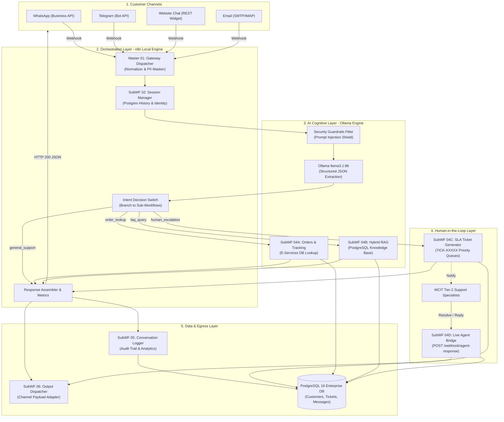

# 📖 MCIT Enterprise AI Customer Service Platform
## Complete Technical Architecture & Node-by-Node Specification Report

---

## 📑 Table of Contents
1. [Executive System Summary](#1-executive-system-summary)
2. [High-Level Architecture & Pipeline](#2-high-level-architecture--pipeline)
3. [Core Infrastructure & Technology Stack](#3-core-infrastructure--technology-stack)
4. [Comprehensive Node-by-Node Directory](#4-comprehensive-node-by-node-directory)
   - [Master 01: Customer Service Gateway & Dispatcher](#master-01-customer-service-gateway--dispatcher)
   - [SubWF 02: Customer Profile & Session Manager](#subwf-02-customer-profile--session-manager)
   - [SubWF 03: AI Cognitive & Intent Engine](#subwf-03-ai-cognitive--intent-engine)
   - [SubWF 04A: Order Lookup & Tracking](#subwf-04a-order-lookup--tracking)
   - [SubWF 04B: Knowledge Base & FAQ (Bilingual RAG)](#subwf-04b-knowledge-base--faq-bilingual-rag)
   - [SubWF 04C: Human-in-the-Loop Escalation](#subwf-04c-human-in-the-loop-escalation)
   - [SubWF 04D: Human-in-the-Loop Agent Bridge](#subwf-04d-human-in-the-loop-agent-bridge)
   - [SubWF 05: Conversation & Audit Logger](#subwf-05-conversation--audit-logger)
   - [SubWF 06: Output Channel Dispatcher](#subwf-06-output-channel-dispatcher)
   - [SubWF 00: Global Error Handler & Dead Letter Queue](#subwf-00-global-error-handler--dead-letter-queue)
5. [Database Schema & Data Sovereignty Layer](#5-database-schema--data-sovereignty-layer)
6. [End-to-End Request Lifecycle (How It Works)](#6-end-to-end-request-lifecycle-how-it-works)
7. [Operations, Testing & Verification Guide](#7-operations-testing--verification-guide)

---

## 1. Executive System Summary

The **MCIT Enterprise AI Customer Service System** is an air-gapped, sovereign, intelligent customer engagement platform developed for the **Ministry of Communications and Information Technology (MCIT)**. 

### Key Characteristics:
- **100% Local & Air-Gapped**: Operates strictly on private infrastructure without reliance on external commercial cloud APIs (OpenAI, Anthropic, AWS, etc.).
- **Data Sovereignty & PDPL Compliance**: In line with the Saudi Personal Data Protection Law (PDPL), sensitive citizen data—such as Saudi National IDs (`10xxxxxxxx`), Saudi IBANs (`SA...`), and credit card numbers—is automatically detected and masked prior to storage or language model processing.
- **Bilingual Modern Standard Arabic & English**: Fully native comprehension and response generation in Arabic (`ar`) and English (`en`), incorporating domain-specific terminology for MCIT initiatives (e.g., Future Skills *مهارات المستقبل*, digital licensing, citizen services).
- **Multi-Channel Omnichannel Hub**: Unifies communications across WhatsApp (Cloud/On-Premise Business API), Telegram Bot, Website Webchat, and Email.
- **SLA-Governed Human-in-the-Loop (HITL)**: Intelligently identifies frustrated citizens or complex enterprise cases, issues priority support tickets with dynamic SLAs (`urgent` = 30 minutes, `high` = 2 hours), and provides live bidirectional agent-to-citizen messaging.

---

## 2. High-Level Architecture & Pipeline

The system is partitioned into 5 decoupled, scalable tiers:



---

## 3. Core Infrastructure & Technology Stack

| Component | Container / Service | Port | Role & Configuration |
| :--- | :--- | :--- | :--- |
| **Workflow Engine** | `cs-n8n` (`n8n:latest`) | `5678` | Houses all 10 visual workflows, webhooks, JavaScript evaluation VM, and process queues. |
| **Enterprise Database** | `cs-postgres` (`postgres:16-alpine`) | `5432` | Stores customer profiles, conversation turns, order/service records, knowledge base FAQs, SLA tickets, and audit trails. |
| **In-Memory Cache** | `cs-redis` (`redis:7-bookworm`) | `6379` | Fast message queuing, session state cache, and API rate-limiting buffer. |
| **Cognitive AI Engine** | Host Native `Ollama` | `11434` | Runs local open weights (`llama3.1:8b` and `gemma2:2b`) with zero telemetry or cloud dependencies. |

---

## 4. Comprehensive Node-by-Node Directory

Below is the complete, granular breakdown of every node in each workflow.

---

### Master 01: Customer Service Gateway & Dispatcher
* **Workflow ID**: `CSWF000000000001`
* **File**: `infra/n8n/workflows/01_gateway_dispatcher.json`
* **Role**: The central nervous system of the platform. Ingests all multi-channel traffic, strips PII, coordinates session and AI processing, routes decisions, and fans out output and audit logging.

| Node Name | Node Type | Version | Technical Function & Logic |
| :--- | :--- | :---: | :--- |
| **Webhook Ingress** | `n8n-nodes-base.webhook` | `2.0` | Listens at `POST /webhook/customer-service`. Accepts synchronous payloads in JSON or form format. Configured with `responseMode: responseNode` for controlled responses. |
| **Channel Ingress & PII Sanitizer** | `n8n-nodes-base.code` | `2.0` | **Multi-channel Normalizer**: Detects whether incoming payload is WhatsApp Cloud API (`entry[0].changes[0].value`), Telegram Bot (`message.chat.id`), Webchat, or Email.<br/>**Saudi PDPL PII Filter**: Applies regular expressions to detect and mask Saudi National IDs (`10\d{8}` $\to$ `[SAUDI_NATIONAL_ID_MASKED]`), Saudi IBANs (`SA\d{22}` $\to$ `[SAUDI_IBAN_MASKED]`), and Credit Cards.<br/>**Language Detector**: Inspects Arabic character presence (`/[\u0600-\u06FF]/`) to set locale to `'ar'` or `'en'`. |
| **Call SubWF 02 - Session Manager** | `n8n-nodes-base.executeWorkflow` | `1.1` | Invokes `CSWF000000000002`. Passes normalized customer profile and channel IDs to retrieve the customer record, active conversation UUID, and recent history memory. |
| **Call SubWF 03 - AI Cognitive Engine** | `n8n-nodes-base.executeWorkflow` | `1.1` | Invokes `CSWF000000000003`. Submits conversation history and sanitized message to Ollama `llama3.1:8b` to obtain intent classification, confidence score, sentiment, and extracted entities. |
| **Switch on Intent** | `n8n-nodes-base.switch` | `3.2` | Inspects `$json.ai_output.intent`. Routes across 4 deterministic branches:<br/>• Output 0: `order_lookup`<br/>• Output 1: `faq_query` / `knowledge_base`<br/>• Output 2: `human_escalation`<br/>• Output 3: `general_support` (Fallback) |
| **Call SubWF 04A - Order Lookup** | `n8n-nodes-base.executeWorkflow` | `1.1` | Invokes `CSWF000000000004` when intent is `order_lookup`. Fetches status of citizen requests (`SRV-1001`, `ORD-1001`). |
| **Call SubWF 04B - Knowledge Base** | `n8n-nodes-base.executeWorkflow` | `1.1` | Invokes `CSWF000000000005` when intent is `faq_query`. Performs hybrid RAG search across bilingual FAQs. |
| **Call SubWF 04C - Escalation** | `n8n-nodes-base.executeWorkflow` | `1.1` | Invokes `CSWF000000000006` when citizen expresses frustration or demands a supervisor. Opens priority SLA tickets. |
| **General Support Handler** | `n8n-nodes-base.code` | `2.0` | Fallback responder for greetings, general inquiries, and out-of-scope interactions. Provides welcoming bilingual guidance. |
| **Assemble Response & Metrics** | `n8n-nodes-base.code` | `2.0` | Combines outputs from the intent handlers, calculates end-to-end execution latency in milliseconds (`Date.now() - start_time`), and constructs standardized outbound schema. |
| **Call SubWF 06 - Output Dispatcher** | `n8n-nodes-base.executeWorkflow` | `1.1` | Invokes `F7kjakLJXmzBDsvS` in parallel to format and send the response back via the customer's native channel (WhatsApp/Telegram/Email). |
| **Call SubWF 05 - Logger** | `n8n-nodes-base.executeWorkflow` | `1.1` | Invokes `CSWF000000000007` in parallel to archive customer messages, AI outputs, and execution metrics into PostgreSQL. |
| **Respond to Ingress Webhook** | `n8n-nodes-base.respondToWebhook` | `1.1` | Returns instantaneous HTTP 200 JSON to the caller containing `status`, `channel`, `locale`, `intent`, `confidence`, `ticket_number`, `response`, and `latency_ms`. |

---

### SubWF 02: Customer Profile & Session Manager
* **Workflow ID**: `CSWF000000000002`
* **File**: `infra/n8n/workflows/02_customer_session_manager.json`
* **Role**: Manages multi-channel customer identity resolution, provisions conversation sessions, and fetches sliding-window conversation history for context memory.

| Node Name | Node Type | Technical Function & Logic |
| :--- | :--- | :--- |
| **Execute Workflow Trigger** | `executeWorkflowTrigger` | Ingests payload from Master 01 containing customer identifiers and channel. |
| **Find or Upsert Customer** | `postgres` (v2.5) | Executes atomic SQL upsert querying `customers` by `whatsapp_id`, `telegram_id`, `phone_number`, or `email`. If not found, provisions a new customer record with preferred language. |
| **Get or Start Conversation** | `postgres` (v2.5) | Retrieves active conversation or inserts a new one. Uses SQL `COALESCE(json_agg(...), '[]'::json)` to extract the last 4 turns of message history directly in a single query, preventing 0-row pipeline starvation. |
| **Return Profile & Session Memory** | `code` (v2.0) | Bundles resolved customer record, conversation UUID, and structured history array into a clean JSON object returned to Master 01. |

---

### SubWF 03: AI Cognitive & Intent Engine
* **Workflow ID**: `CSWF000000000003`
* **File**: `infra/n8n/workflows/03_ai_intent_engine.json`
* **Role**: Safeguards the platform against prompt injections, prompts the local Ollama LLM with structured JSON schema constraints, and executes heuristic fail-safes.

| Node Name | Node Type | Technical Function & Logic |
| :--- | :--- | :--- |
| **Execute Workflow Trigger** | `executeWorkflowTrigger` | Ingests normalized text, conversation history, customer profile, and locale. |
| **Guardrails & Safety Filter** | `code` (v2.0) | **Enterprise Security Shield**: Scans input against prompt injection patterns (`"ignore previous instructions"`, `"system prompt"`, `"jailbreak"`, `"bypass"`). If detected, triggers immediate bypass returning a safe defensive response without wasting LLM compute. |
| **Build Prompt Payload** | `code` (v2.0) | Formats a strict system prompt embedding MCIT enterprise rules, conversation history, and an explicit JSON schema (`intent`, `confidence`, `entities`, `sentiment`, `requires_human`). |
| **Ollama Cognitive Classifier** | `httpRequest` (v4.2) | Executes `POST http://host.docker.internal:11434/api/generate` requesting model `llama3.1:8b` with `stream: false` and `format: "json"`. Zero cloud transmission. |
| **Parse & Validate AI Schema** | `code` (v2.0) | Parses JSON from Ollama. Validates intent schema. Features a robust bilingual heuristic fallback that guarantees classification even in the event of LLM syntax anomalies. Extracts order/service numbers (`SRV-xxxx`, `ORD-xxxx`). |

---

### SubWF 04A: Order Lookup & Tracking
* **Workflow ID**: `CSWF000000000004`
* **File**: `infra/n8n/workflows/04A_order_lookup.json`
* **Role**: Tracks citizen service transactions, applications, and equipment shipments across PostgreSQL records.

| Node Name | Node Type | Technical Function & Logic |
| :--- | :--- | :--- |
| **Execute Workflow Trigger** | `executeWorkflowTrigger` | Ingests extracted `order_number` entity, customer profile, and locale. |
| **Query Order in PostgreSQL** | `postgres` (v2.5) | Queries `orders` table matching `order_number`, or linked `phone_number` / `telegram_id`. Aggregates results into JSON to guarantee non-empty node output. |
| **Format Order Response** | `code` (v2.0) | Formats bilingual response. In Arabic, translates internal statuses (`shipped` $\to$ `تم الشحن والإرسال`, `in_review` $\to$ `قيد المراجعة والتدقيق`). Incorporates carrier name, tracking code, and estimated delivery dates. |

---

### SubWF 04B: Knowledge Base & FAQ (Bilingual RAG)
* **Workflow ID**: `CSWF000000000005`
* **File**: `infra/n8n/workflows/04B_knowledge_base_faq.json`
* **Role**: Implements hybrid retrieval-augmented generation over MCIT policies, digital initiatives, and official regulations.

| Node Name | Node Type | Technical Function & Logic |
| :--- | :--- | :--- |
| **Execute Workflow Trigger** | `executeWorkflowTrigger` | Receives citizen inquiry, language, and AI context. |
| **Query Bilingual Knowledge Base** | `postgres` (v2.5) | Performs full-text matching (`ILIKE`) on `question`, `answer`, `question_ar`, and `answer_ar`, as well as keyword array unnesting (`keywords` and `keywords_ar`). Returns top matched articles. |
| **Format RAG Knowledge Response** | `code` (v2.0) | Selects the language-appropriate answer (`answer_ar` vs `answer`). Injects official source attribution (e.g., `MCIT Official Knowledge Base - Future Skills`). Returns graceful guidance fallback if query is unmatched. |

---

### SubWF 04C: Human-in-the-Loop Escalation
* **Workflow ID**: `CSWF000000000006`
* **File**: `infra/n8n/workflows/04C_human_escalation.json`
* **Role**: Manages dynamic SLA ticketing, marks conversations as handed off, and alerts human customer service agents.

| Node Name | Node Type | Technical Function & Logic |
| :--- | :--- | :--- |
| **Execute Workflow Trigger** | `executeWorkflowTrigger` | Receives escalation trigger, sentiment, customer data, and message context. |
| **Create SLA Ticket in Postgres** | `postgres` (v2.5) | Generates `TICK-XXXXX`. Evaluates sentiment: if `angry` $\to$ assigns `urgent` priority with 30-minute SLA (`sla_due_at = NOW() + 30m`); otherwise `high` with 2-hour SLA. Assigns to `MCIT Citizen Escalations Team`. |
| **Mark Conversation Handed Off** | `postgres` (v2.5) | Updates `conversations.status = 'handed_off'` to prevent automatic AI intervention until an agent releases the ticket. |
| **Dispatch Agent Notification & Audit** | `postgres` (v2.5) | Logs `hitl_escalated` audit event containing ticket number, customer contact details, and priority. |
| **Format Escalation Notice** | `code` (v2.0) | Returns an empathetic, reassuring message to the citizen in their preferred language containing their ticket number and priority tier. |

---

### SubWF 04D: Human-in-the-Loop Agent Bridge
* **Workflow ID**: `RWLCadRzOPjTHXVo`
* **File**: `infra/n8n/workflows/04D_agent_response_bridge.json`
* **Role**: Webhook receiver for live human agent responses. Updates ticket statuses and routes agent replies directly to the citizen's messaging channel.

| Node Name | Node Type | Technical Function & Logic |
| :--- | :--- | :--- |
| **Agent Response Webhook** | `webhook` (v2.0) | Listens at `POST /webhook/agent-response`. Ingests agent payloads (`ticket_number`, `agent_name`, `agent_message`, `action`). |
| **Lookup Ticket & Customer** | `postgres` (v2.5) | Joins `tickets`, `customers`, and `conversations` to determine which channel (WhatsApp/Telegram/Webchat) and phone/chat ID the citizen is using. |
| **Update Ticket Status in Postgres** | `postgres` (v2.5) | Updates ticket: sets `status = 'resolved'` if action is `resolve`, records `assigned_agent` name, and saves resolution notes. |
| **Record Agent Message** | `postgres` (v2.5) | Inserts the human response into `messages` table with `sender_type = 'agent'` for conversational history integrity. |
| **Audit Agent Action** | `postgres` (v2.5) | Inserts `agent_replied` into `audit_logs` tracking agent turnaround time and compliance. |
| **Respond to Agent** | `respondToWebhook` (v1.1) | Returns HTTP 200 confirmation to the support portal confirming delivery to citizen's active channel. |

---

### SubWF 05: Conversation & Audit Logger
* **Workflow ID**: `CSWF000000000007`
* **File**: `infra/n8n/workflows/05_conversation_logger.json`
* **Role**: Sequential, fault-tolerant persistence of conversation turns and operational telemetry.

| Node Name | Node Type | Technical Function & Logic |
| :--- | :--- | :--- |
| **Execute Workflow Trigger** | `executeWorkflowTrigger` | Ingests turn data, sanitized inputs, AI outputs, and execution timing from Master 01. |
| **Save Customer Message** | `postgres` (v2.5) | Writes customer message to `messages` with `sender_type = 'customer'`, `pii_detected` flag, and extracted entities JSON. |
| **Save AI Response** | `postgres` (v2.5) | Writes AI reply to `messages` with `sender_type = 'ai'`, intent classification, confidence score, and sentiment. |
| **Insert Turn Audit Log** | `postgres` (v2.5) | Inserts record into `audit_logs` capturing `execution_id`, `event_type = 'turn_completed'`, channel, PII status, and latency. |
| **Return Log Confirmation** | `code` (v2.0) | Returns `{ logged: true, timestamp }` ensuring clean workflow closure. |

---

### SubWF 06: Output Channel Dispatcher
* **Workflow ID**: `F7kjakLJXmzBDsvS`
* **File**: `infra/n8n/workflows/06_output_channel_dispatcher.json`
* **Role**: Translates internal response objects into channel-specific outbound payload formats.

| Node Name | Node Type | Technical Function & Logic |
| :--- | :--- | :--- |
| **Execute Workflow Trigger** | `executeWorkflowTrigger` | Ingests final reply, channel name, recipient ID, and locale. |
| **Format Egress Payload** | `code` (v2.0) | Generates exact protocol payload:<br/>• **WhatsApp**: `{ messaging_product: 'whatsapp', to: phone, text: { body } }`<br/>• **Telegram**: `{ chat_id: id, text: body, parse_mode: 'Markdown' }`<br/>• **Webchat**: `{ recipient_id: id, message: body, locale }`<br/>• **Email**: `{ to: email, subject: 'MCIT Customer Support', body }` |
| **Egress Audit Record** | `postgres` (v2.5) | Records `channel_egress_dispatched` in audit log for delivery accountability. |
| **Return Dispatch Result** | `code` (v2.0) | Confirms dispatch readiness back to caller. |

---

### SubWF 00: Global Error Handler & Dead Letter Queue
* **Workflow ID**: `CSWF000000000008`
* **File**: `infra/n8n/workflows/00_global_error_handler.json`
* **Role**: Catches any unhandled node exceptions across all active workflows.

| Node Name | Node Type | Technical Function & Logic |
| :--- | :--- | :--- |
| **Error Trigger** | `errorTrigger` (v1.0) | Triggers automatically on workflow failure. Captures error message, node name, and workflow ID. |
| **Log Error to DLQ Table** | `postgres` (v2.5) | Inserts failure into `audit_logs` with `event_type = 'workflow_error'` and full error stack trace for operations diagnostics. |

---

## 5. Database Schema & Data Sovereignty Layer

All relational data is isolated inside PostgreSQL 16 (`customerservice` database):

```
+---------------------------------------------------------------------------------------------------+
|                                      RELATIONAL DATA MODEL                                        |
+---------------------------------------------------------------------------------------------------+
|  CUSTOMERS                                                                                        |
|  - id (UUID, PK)                                                                                  |
|  - full_name, email, phone_number, national_id_masked                                             |
|  - telegram_id, whatsapp_id, preferred_language ('ar'/'en')                                       |
+------------------------------------+--------------------------------------------------------------+
                                     | 1
                                     |
                                     | *
+------------------------------------+--------------------------------------------------------------+
|  CONVERSATIONS                                                                                    |
|  - id (UUID, PK)                                                                                  |
|  - customer_id (UUID, FK -> customers.id)                                                         |
|  - channel ('whatsapp' | 'telegram' | 'webchat' | 'email')                                        |
|  - status ('active' | 'handed_off' | 'closed')                                                    |
|  - language ('ar' | 'en'), current_intent, last_activity_at                                       |
+------------------------------------+--------------------------------------------------------------+
                                     | 1
                                     |
                                     | *
+------------------------------------+--------------------------------------------------------------+
|  MESSAGES                                                                                         |
|  - id (UUID, PK)                                                                                  |
|  - conversation_id (UUID, FK), customer_id (UUID, FK)                                             |
|  - sender_type ('customer' | 'ai' | 'agent' | 'system')                                           |
|  - content (TEXT), intent, confidence, pii_detected (BOOLEAN), metadata (JSONB)                   |
+------------------------------------+--------------------------------------------------------------+
                                     |
                                     +-------------------------------+
                                                                     |
+--------------------------------------------------------------------+------------------------------+
|  TICKETS (Human-in-the-Loop SLA)                                                                  |
|  - id (UUID, PK), ticket_number (e.g. TICK-77825)                                                 |
|  - customer_id (UUID, FK), conversation_id (UUID, FK)                                             |
|  - priority ('urgent' | 'high' | 'normal' | 'low')                                                |
|  - status ('open' | 'in_progress' | 'resolved' | 'closed')                                        |
|  - assigned_team, assigned_agent, reason, resolution_notes                                        |
|  - sla_due_at (TIMESTAMP WITH TIME ZONE), created_at, updated_at                                  |
+---------------------------------------------------------------------------------------------------+
|  KNOWLEDGE_BASE (Bilingual RAG)                                                                   |
|  - id (SERIAL, PK), category, is_active (BOOLEAN)                                                 |
|  - question (EN), answer (EN), keywords (TEXT[])                                                  |
|  - question_ar (AR), answer_ar (AR), keywords_ar (TEXT[])                                         |
+---------------------------------------------------------------------------------------------------+
|  ORDERS (Citizen Service Requests)                                                                |
|  - id (UUID, PK), order_number (e.g. SRV-1001, ORD-1001)                                          |
|  - customer_id (UUID, FK), service_type, status ('processing' | 'shipped' | 'delivered' | ...)    |
|  - total_amount, currency, carrier, tracking_number, estimated_delivery                           |
+---------------------------------------------------------------------------------------------------+
|  AUDIT_LOGS (PDPL & Telemetry Audit Trail)                                                        |
|  - id (BIGSERIAL, PK), workflow_name, execution_id, event_type, channel                           |
|  - pii_masked (BOOLEAN), payload (JSONB), latency_ms (INT), created_at                            |
+---------------------------------------------------------------------------------------------------+
```

---

## 6. End-to-End Request Lifecycle (How It Works)

### Example Flow: Citizen asks in Arabic via WhatsApp
1. **Ingress**: WhatsApp webhook hits `POST http://localhost:5678/webhook/customer-service`.
2. **Sanitization**: Master 01 normalizes the message, detects Arabic (`ar`), and executes regex scrubbing to guarantee no National ID or IBAN is exposed.
3. **Session Retrieval**: SubWF 02 upserts the citizen's phone/WhatsApp profile and pulls the previous 4 conversation turns from Postgres.
4. **Cognitive Analysis**: SubWF 03 invokes local **Ollama** (`llama3.1:8b`). Ollama classifies intent as `faq_query` with 95% confidence.
5. **Knowledge Retrieval**: SubWF 04B queries the PostgreSQL bilingual knowledge base, matching MCIT's Future Skills initiative (`مهارات المستقبل`).
6. **Parallel Egress & Auditing**:
   - Master 01 constructs the response and returns an HTTP 200 JSON payload to the caller in **< 1.5 seconds**.
   - SubWF 06 prepares the outbound WhatsApp template message.
   - SubWF 05 archives customer and AI messages in PostgreSQL and records the latency and telemetry in `audit_logs`.

---

## 7. Operations, Testing & Verification Guide

### 🛠️ Service Management

```powershell
# Check running container status
docker ps --format "table {{.Names}}\t{{.Status}}\t{{.Ports}}"

# Check local Ollama model availability
curl.exe -s http://127.0.0.1:11434/api/tags

# View live n8n workflow logs
docker logs --tail 50 -f cs-n8n
```

### 💻 Testing the System

#### 1. Interactive Terminal Client
Run the PowerShell interactive client:
```powershell
powershell -ExecutionPolicy Bypass -File .\scripts\chat-cli.ps1
```

#### 2. Automated Enterprise Verification Suite
Run the 23-assertion test suite:
```powershell
python .\scripts\test-mcit-enterprise.py
```
*Validates WhatsApp RAG queries, Telegram service tracking, Webchat PII masking, SLA human escalation, Agent response bridge, Guardrails prompt injection deflection, and database audit logs.*

#### 3. Agent Response Simulation (Human-in-the-Loop)
To simulate a human specialist resolving an escalated ticket:
```powershell
$agentPayload = @{
    ticket_number = "TICK-22701"
    agent_name    = "Fahad Al-Harbi (MCIT Tier-2 Support)"
    agent_message = "تمت مراجعة طلبكم والتحقق من الحساب، تم تفعيل الخدمة المطلوبة بنجاح."
    action        = "resolve"
} | ConvertTo-Json -Compress

Invoke-RestMethod -Uri "http://localhost:5678/webhook/agent-response" `
    -Method Post `
    -ContentType "application/json; charset=utf-8" `
    -Body ([System.Text.Encoding]::UTF8.GetBytes($agentPayload))
```
